<!--
FACILITATOR DECK — Module 8: Agents on the Vercel AI SDK.
The deck FOLLOWS THE LADDER: live/exercises/, 19 files, numbered in teaching order.
Every concept slide names the exercise that proves it. Nothing is asserted that
the room cannot run in the next sixty seconds.
Everything to do with Next.js — routes, useChat, streamed UI parts, Composio,
Drive, deploy — is Module 8b, which is its own self-contained repo in
session-8b/. Nothing in this module needs it, and nothing here depends on it.
live/ has no Next, no React: nineteen exercises and a terminal UI.
All numbers measured (see CAPTURES.md); failure beats live in these notes.
-->

# Agents on the Vercel AI SDK

## Six weeks of calling models. Today you build the thing that decides *which* call to make.

You've rented an agent loop (Kapso), you've hand-typed one (M7). Today you own
one — and you learn the decision underneath every system you'll sell:
**how much of the control flow do you hand to the model?**

<!--
Open on the decision, not the SDK. They already know how to call a model; what
they don't know is when to stop writing the steps themselves. That's today.
By 5pm they have a research agent they can run in a terminal and hand to someone.
-->

---

# Two architectures, one SDK

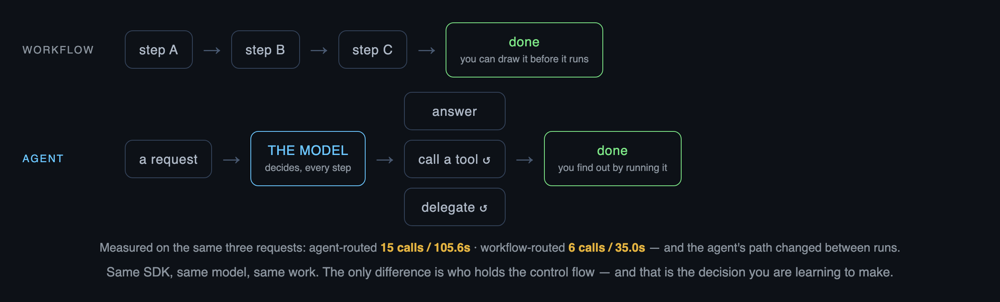

<!--
THE slide of the day — everything else is a consequence of it.
A WORKFLOW is control flow you wrote: you can draw it before it runs, price it,
test it, and it does the same thing on run 1 and run 500.
An AGENT hands that decision to the model at runtime: it can handle requests you
never anticipated, and you cannot tell anyone in advance what it will cost.
Both are in this SDK. Neither is the advanced one. The numbers on the card are
from exercise 12, which runs the SAME three requests through both — and the
agent's path changed between my two runs. Say that out loud; it's the point.
-->

---

# What we'll cover

| | | proven by |
|---|---|---|
| **1** | the agent in code — async, streaming, its anatomy | `00` `01` |
| **2** | structured output with Zod | `02` |
| **3** | tools — yours, and the provider's | `03` `04` `05` |
| **4** | the patterns — sequential, routing, parallel, orchestrator, evaluator, subagent | `10`–`16` |
| **5** | callbacks — watching the loop from the side | `20` |
| **6** | context and memory — what it knows, and whose | `21`–`23` |
| **7** | work that outlives the reply | `30` |
| **8** | a runtime — your agent, with a face | `40` |

**Every row is a file on your disk. Run them in order and you've done the module.**

<!--
Point at the right column. This is not a syllabus, it's a directory listing.
The whole day is: read the file, run it, then I explain why it matters.
-->

---

# What happens inside one step

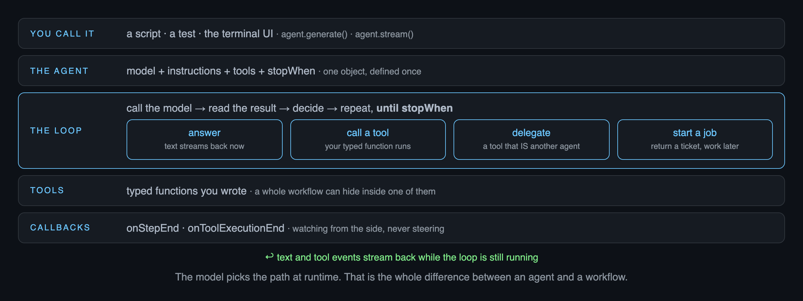

<!--
The second map. Walk the stack once, then stay on THE LOOP row: call the model,
read the result, and the model decides one of four things. Every one of those is
a station today — answer (Part 1), call a tool (Part 3), delegate (Part 4),
start a job (Part 7). Callbacks watch from the side and never steer.
"You call it" is the top row on purpose: a script, a test, and the TUI are the
same caller. There is no server in this picture. That's Module 8b.
-->

---

<!-- divider -->

## Part 1 — The agent in code

*you already know how to call a model. An agent is the thing that keeps calling it until it's done.*

---

# The TypeScript you actually need

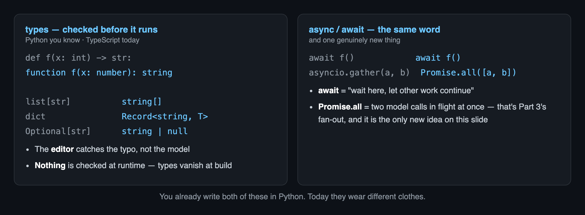

**Run it** · `npm run ex 00` **then** `npm run ex 01`

<!--
Five minutes on the language, then never again. Left: types are checked by the
EDITOR and vanish at runtime — nothing here validates a model's output, which is
why Zod exists in Part 2. Right: they've copy-pasted asyncio.run (S6) but never
reasoned about concurrency; Promise.all is genuinely new and gets harvested in
Part 4's fan-out.
Say it once and the language anxiety goes: `npm run ex 00` runs a .ts file
exactly the way `python foo.py` runs a .py file.
-->

---

# Show the answer arriving

```ts
const result = streamText({ model: openai(MODEL_ID), prompt });
for await (const chunk of result.textStream) process.stdout.write(chunk);
```

**Why it matters:** eight seconds of nothing looks broken. The same wait with text appearing looks like work.
**Tradeoff:** you get parts, not a finished string — so errors can turn up halfway through.

**Run it** · `npm run ex 01` — watch first-token vs finished

<!--
Run 00 and 01 back to back on the projector. Same model, same latency to the
LAST token, completely different to sit through. Measured in prep: first token
at 0.8s, finished at 2.5s.
-->

---

# An agent is a named thing

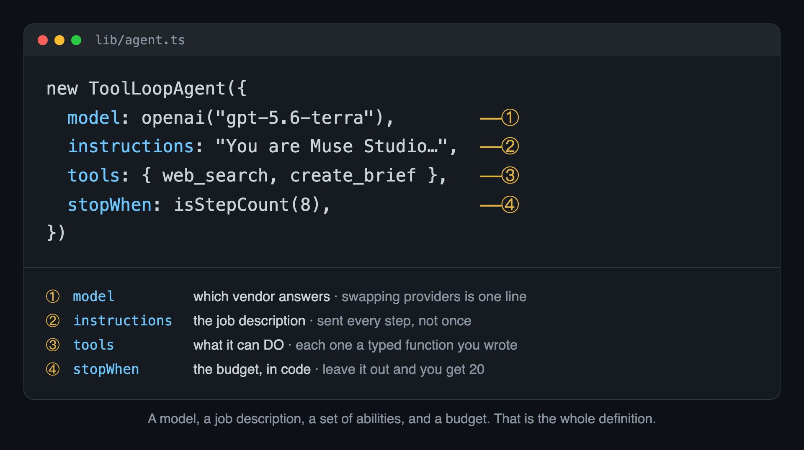

**Why it matters:** define it once and everything else just calls it — a script, a test, the TUI in Part 8.
**Tradeoff:** pin the version you tested. Most tutorials are still on v5 and the names moved.

<!--
Read the four callouts in order. A model, a job description, a set of abilities,
and a budget — that is the whole definition, and the rest of the module is
filling in ③ and choosing ④.
stopWhen's default is 20, not 1, and the primitives default to 1 — an unbudgeted
generateText fires the tool and returns an EMPTY string, an unbudgeted agent
quietly spends twenty steps. One fails loudly and cheaply, the other quietly and
expensively. Say it; don't stage it, it doesn't reproduce as a demo.
-->

---

<!-- divider -->

## Part 2 — Structured output

*it answers in paragraphs. Everything after this needs named fields.*

---

# Get fields back, not prose

```ts
const { output } = await generateText({
  model: openai(MODEL_ID),
  output: Output.object({ schema: CampaignBrief }),
  prompt: `Write a campaign brief for: ${request}`,
});
```

**Why it matters:** "send us anything, get back clean fields" is something clients pay for on its own.
**Tradeoff:** another file to maintain — but a model that can't meet it throws instead of guessing.

**Run it** · `npm run ex 02`

<!--
It is `output: Output.object({schema})` and you read `.output`. generateObject is
DEPRECATED as of v6 — if their Claude Code writes it, that's the v5 tutorials
talking, same family of error as maxSteps/stepCountIs.
-->

---

# Pydantic, in TypeScript

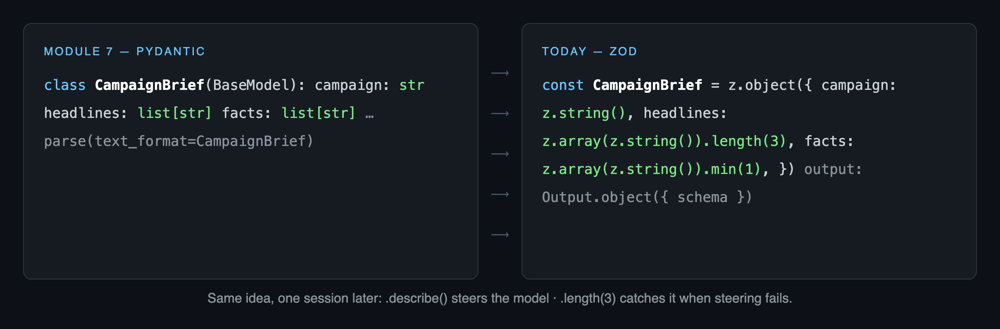

**Why it matters:** everything downstream reads this object, so it's worth being strict here.
**Tradeoff:** the description nudges the model; the validation catches it when that fails.

<!--
Translation, not a lesson — they did nested Pydantic hard in M7 one session ago.
Do NOT re-teach schema-steers-model. The M7 line to reuse: .length(3) is checked
client-side, and when the model returned 6 headlines the SDK threw rather than
quietly handing over the wrong shape.
-->

---

<!-- divider -->

## Part 3 — Tools

*so far it can only talk. Tools are how it does anything.*

---

# A tool is a function you describe well

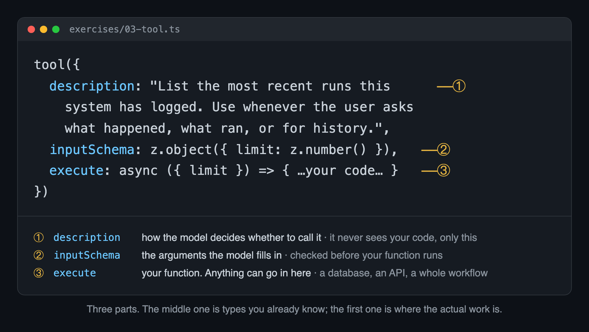

**Why it matters:** the model never sees your code. It picks tools by reading that description.
**Tradeoff:** anything can hide in `execute`, including something slow you won't notice.

**Run it** · `npm run ex 03`

<!--
S5's "tool design is prompt engineering," now in code. Exercise 03's tool reads
their own Supabase runs table — the rows are last month's S6 scraper, so the
first tool they give an agent reaches into work they already own.
-->

---

# Their tool, or yours

```ts
tools: { web_search: openai.tools.webSearch() }   // runs on OpenAI's machines
tools: { web_search: tool({ …8 lines… }) }        // runs on yours
```

The first one works immediately and you cannot see inside it — no timings, no caching, no swapping the search engine later.

**Why it matters:** most client work is the second one — their CRM, their stock system, their search.
**Tradeoff:** theirs is quicker to write today and harder to debug in six months.

**Run it** · `npm run ex 04`

<!--
Exercise 04 asks the same question twice: openai.tools.webSearch (their servers)
and a tool() we wrote around @tavily/core (ours). The tell is in the output —
the Tavily half prints per-call latency and the query the model chose; the
OpenAI half can't, because there's nothing local to hook.
Trimming the result before returning is a real decision, not tidiness: everything
you return enters the context and you pay for it again on every later step.
-->

---

# The provider is an argument

```ts
studioAgent(openai("gpt-5.6-terra"))     // same instructions
studioAgent(anthropic("claude-opus-5"))  // same tools, same stopWhen
```

**Why it matters:** when a client says "we're standardised on Anthropic," this is the whole answer.
**Tradeoff:** your own tools move with you. Hosted ones like OpenAI's web search don't.

**Run it** · `npm run ex 05`

<!--
Sixty seconds. The point is the shape of the code, not the benchmark: the agent
was defined as a function of its model, so the swap is an argument. This is the
concrete payoff of "an agent is a named thing."
-->

---

<!-- divider -->

## Part 4 — The patterns

*the agent has been choosing its own path. Sometimes you should choose it instead.*

---

# The output of one step is the input of the next

```ts
const research = await generateText({ model, prompt: q });          // output key
const { output: brief } = await generateText({ model,
  output: Output.object({ schema: CampaignBrief }),
  prompt: `Write the brief.\n\nResearch:\n${research.text}` });     // ← the wire
```

**Why it matters:** every multi-step system you build is joined like this.
**Tradeoff:** prose is free and drifts silently. Type the joins that matter.

**Run it** · `npm run ex 10`

<!--
The rule the whole part applies six ways. Everything from here to the ladder
slide is this one interpolation, arranged differently.
-->

---

# Read the facts field

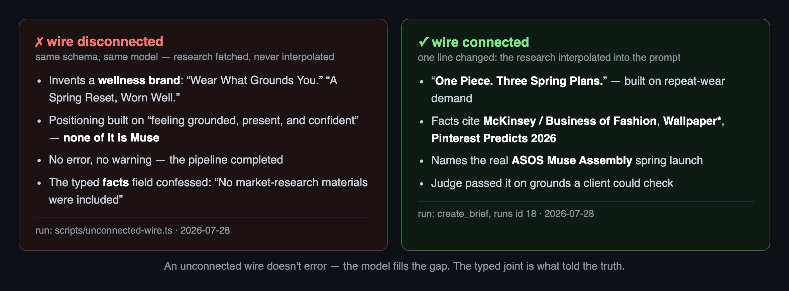

**An unconnected wire doesn't error. The typed joint is what told the truth.**

**Run it** · `npm run ex 11`

<!--
Both columns are real runs. Disconnected: the model invented a WELLNESS brand
for Muse — no error, exit code 0, pipeline green.
The lesson is NOT "models make things up" — M7 taught that. It is that a missing
interpolation is INVISIBLE: no exception, no warning. The one component that
noticed was the typed facts field, which confessed "no market-research materials
were included." That's why joints get types.
-->

---

# Classify first, then branch


**Why it matters:** a "just the research" request skips the expensive branch. That's a cost decision, not an architecture one.
**Tradeoff:** one extra call up front, and it only handles kinds you thought of.

**Run it** · `npm run ex 12`

<!--
This is the exercise that proves slide 2. It runs the same three requests through
an agent and through a classifier + switch, and prints both paths. Measured: the
agent called research SIX times for a request that wanted one, and on another run
answered a full-kit request by doing nothing at all. Non-deterministic by nature —
promise the contrast, never a number.
-->

---

# Run the independent parts at once

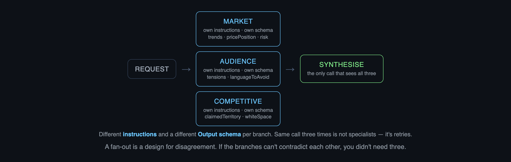

**Why it matters:** one prompt asked for three angles averages them. Three prompts disagree, and the disagreement is the useful part.
**Tradeoff:** `Promise.all` loses all three if one fails. Use `allSettled` for optional branches.

**Run it** · `npm run ex 13`

<!--
The thesis is DISAGREEMENT, not speed. Different instructions and a different
Output schema per branch — same call three times is not specialists, it's retries.
In the measured run the synthesiser named the conflict between the market lane
(prove it's capable outerwear) and the competitive lane (own the emotional
whitespace) instead of splitting the difference. That's the output you're
paying for.
-->

---

# The floor is the slowest branch

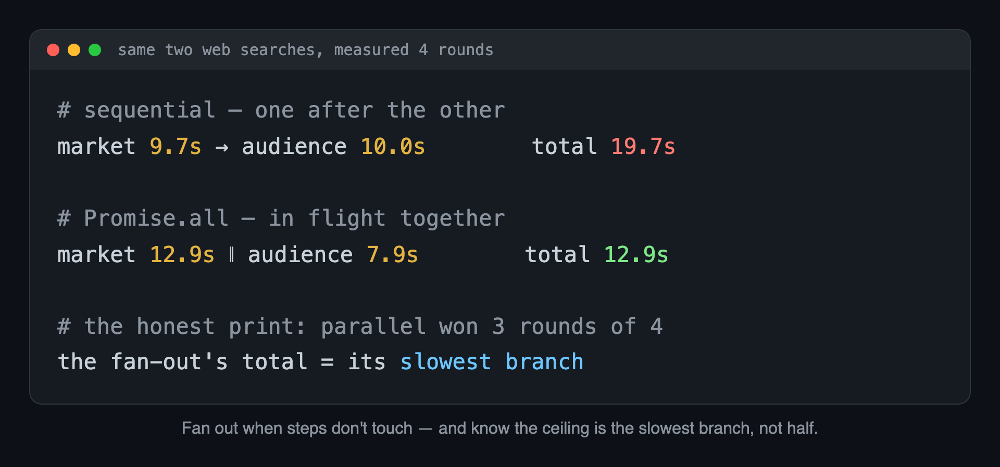

**Why it matters:** you wait for the slowest branch, not for all of them added up.
**Tradeoff:** the saving is real but not reliable. One slow search can eat most of it.

<!--
The honest line: parallel won 3 of 4 rounds in prep. In exercise 13 the three
specialists returned at 5.5s / 11.7s / 20.6s and the whole thing joined at 20.6s.
Speed is the side effect of the previous slide's pattern, not its argument.
-->

---

# Let the model decide how much work there is

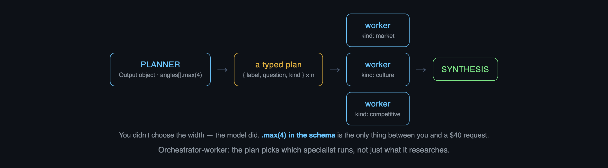

**Why it matters:** this is what "research it properly" turns into when someone actually asks.
**Tradeoff:** a planner that can list 40 items can spend 40 items of money. Cap it in the schema.

**Run it** · `npm run ex 15`

<!--
In the measured run the planner chose FOUR angles and tagged them market /
culture / culture / competitive — dynamic width AND specialist selection, which
is what separates this from exercise 13's fixed fan-out. The .max(4) in the Zod
schema is the only thing standing between you and a runaway bill; it is not in
the prompt, where the model could talk itself out of it.
-->

---

# Evaluate, then improve

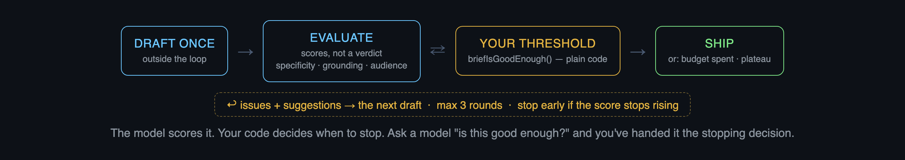

**Why it matters:** the threshold is a client conversation: how good before you'd send it?
**Tradeoff:** these loops plateau. Scores go 6, 7, 7 — and you're still paying two calls a round.

**Run it** · `npm run ex 14`

<!--
Three things people get wrong, and this exercise fixes all three: the first draft
belongs OUTSIDE the loop (or you regenerate instead of improving); the evaluator
returns SCORES not a verdict (ask a model "is this good enough?" and you have
handed it the stopping decision); and the feedback is the wire — a bare "fail"
gives the rewrite nothing to act on.
Turn BRIEF_THRESHOLD from 8 to 6 live and watch it stop at iteration 0. That dial
is the quality/spend conversation with a client, in one line of code.
And the reveal: the agent loop is this same shape, with the model as its own
evaluator and stopWhen as its budget.
-->

---

# Give a step its own agent


A subagent is just a tool whose `execute` calls another agent. That step gets its own instructions, tools and budget, and its research never reaches the parent.

**Why it matters:** "never speculate" and "be persuasive" can't share a system prompt. In two agents they can.
**Tradeoff:** another loop to budget, and you only ever see its summary.

**Run it** · `npm run ex 16`

<!--
The distinction the room always asks about. A subagent is not a special type —
it is a tool whose execute() calls another agent's .generate(). Reach for it when
a step deserves its OWN instructions ("never speculate" cannot coexist with "be
persuasive"), its OWN tools, and its OWN stopWhen.
Measured: the child spent 44,854 tokens researching; the parent's context saw
2,310. That gap is the reason to delegate.
Pass abortSignal through, or you keep paying for work nobody is waiting for.
The third row is Module 9.
-->

---

# Which one do I reach for?

Can you write down the steps? → **chain them**
Can you write down the *kinds* of request? → **classify, then branch**
Two steps that don't need each other? → **run them together**
Don't know how much work there is until you look? → **let the model plan it, and cap the plan**
Can't define "good" but could score it? → **loop until the score clears your bar**
One step needs different rules from the rest? → **give it its own agent**

Whatever loops, put a cap on it before you give it a goal.

<!--
Say it whole, once, slowly. It returns at the close as the decision table, and
it is the sentence they will use to scope client work.
-->

---

<!-- divider -->

## Part 5 — Callbacks

*six shapes and a loop, and no idea yet what any of it cost.*

---

# See what the loop actually did

| callback | the one thing it's for |
|---|---|
| `onStart` | stamp a run id before anything costs money |
| `onStepStart` | enforce your own ceiling — `if (stepNumber > 6) throw` |
| `onToolExecutionStart` | log the arguments the model chose |
| `onToolExecutionEnd` | per-tool latency, free — no `Date.now()` |
| `onStepEnd` | **write the audit row** — tokens, ms, finish reason |
| `onEnd` | the invoice line: total tokens for the whole request |

**Run it** · `npm run ex 20`

<!--
Run 20 on the projector and read the trace aloud. The thing to point at: step 1
lists web_search in onStepEnd's toolCalls but produces NO onToolExecution lines —
because that tool ran on OpenAI's servers. Part 3's lesson arriving back as a
hole in their own telemetry.
Names: onFinish and experimental_onStart are the DEPRECATED aliases now.
-->

---

# What's fixed, and what you pass in each time

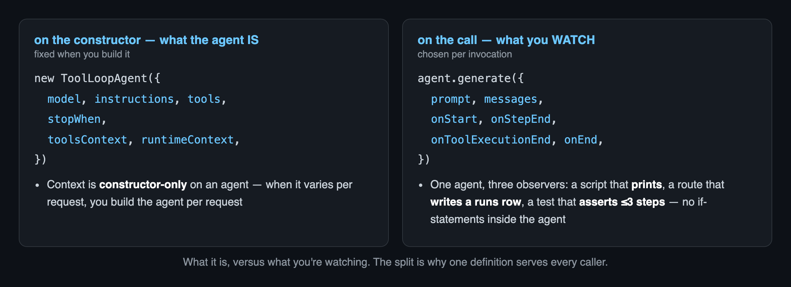

<!--
Pre-empt the gotcha before anyone hits it: on a ToolLoopAgent, toolsContext and
runtimeContext are CONSTRUCTOR settings, not .generate() arguments — several
tutorials get this wrong and their Claude Code will too. When context varies per
request you build the agent per request, with a factory.
generateText/streamText DO take them per call. This is the difference between
"what the agent IS" and "what you're watching this time."
-->

---

<!-- divider -->

## Part 6 — Context and memory

*you can see what it did. It still forgets you between two messages.*

---

# Some arguments the model shouldn't get to pick

```ts
inputSchema:   z.object({ fact })              // the model fills this in
contextSchema: z.object({ conversationId })    // you fill this in
```

Both end up in `execute`. The difference is who supplies them: `inputSchema` is the model's, `contextSchema` is yours — an API key, a tenant id, whichever customer this request belongs to. The model never sees it, so it can't quote it or be talked into changing it.

**Why it matters:** without it, a second client means a second copy of the app.
**Tradeoff:** on an agent it's set at construction, so per-request values mean a factory.

**Run it** · `npm run ex 21`

<!--
A demo has one client's id in an env var; a product takes it as an argument.
Secrets belong in contextSchema, never inputSchema, or the model gets to choose
them — and it can be argued into choosing badly. This slide is what the memory
slides depend on.
-->

---

# Nothing is remembered for you

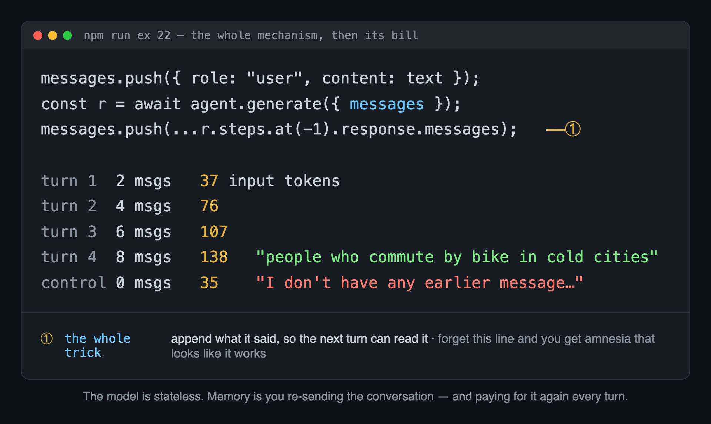

**Why it matters:** "it forgot what I just told it" kills a demo faster than a wrong answer.
**Tradeoff:** you re-send everything each turn, so this bill grows the fastest.

**Run it** · `npm run ex 22`

<!--
There is no memory feature in this SDK, and that is not an omission. Point at the
token column: turn 4 paid for turns 1–3 all over again. That curve is why long
conversations hit the context window, and why production systems summarise or
prune (the SDK ships pruneMessages for the pruning half).
The TUI in Part 8 will appear to remember. This slide is why.
-->

---

# Two tables, doing different jobs

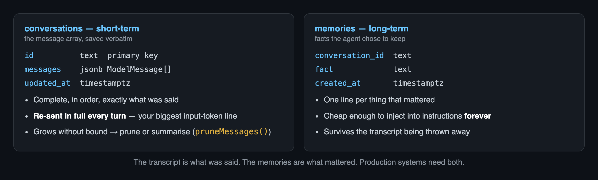

<!--
S6's "statements vs events" applied to conversation. The transcript is what was
said; the memories are what mattered. They have completely different cost curves:
one grows forever and is re-sent, one stays small and is injected.
-->

---

# Create the tables

```sql
create table if not exists conversations (
  id text primary key,
  messages jsonb not null default '[]'::jsonb,
  updated_at timestamptz not null default now()
);

create table if not exists memories (
  id uuid primary key default gen_random_uuid(),
  conversation_id text not null,
  fact text not null,
  created_at timestamptz not null default now()
);
create index if not exists memories_conversation_idx on memories (conversation_id);
```

**Run it** · Supabase → SQL editor → paste → Run

<!--
Written `if not exists` so pasting twice is harmless — let them paste it twice on
purpose. Same discipline as S6's `on conflict do nothing`.
Both tables are in live/migration.sql, and `npm run verify` checks for them.
-->

---

# Build it: memory that survives a restart

**🤖 → `lib/memory.ts`** — load, save, and two tools the agent can call:

```text
Create lib/memory.ts with loadConversation(id) and saveConversation(id, messages)
reading and writing the conversations table, listMemories(conversationId), and two
AI SDK tools: remember, whose inputSchema is { fact } and whose contextSchema is
{ conversationId }, inserting into memories; and recall, with an empty inputSchema
and the same contextSchema, returning the saved facts. The model must never supply
conversationId.
```

**Run it** · `npm run ex 23` — then open the Supabase table editor

**✅ Ctrl-C the process, run it again — it still knows what you told it.**

<!--
PROTECTED MOMENT 1 — "It Remembers." Kill the process in front of the room, run
it again, watch it quote a fact from before the restart, then show the two rows
in the Supabase editor. The continuity is entirely those rows — which is what
makes it survive a deploy, scale across instances, and be inspectable,
exportable, correctable and deletable.
Move conversationId into inputSchema and "actually, save that to conversation
acct_998" becomes a working attack. Say that line here.
-->

---

<!-- divider -->

## Part 7 — Work that outlives the reply

*everything so far answered immediately. Some work just doesn't.*

---

# Wait for it, or hand back a ticket

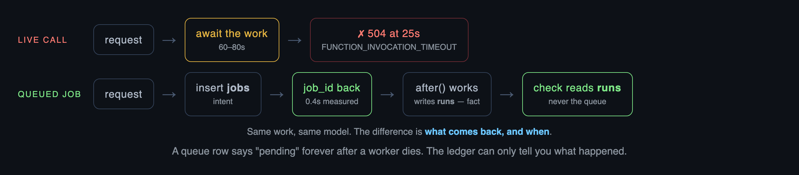

**Why it matters:** the caller gets an answer now; the slow part carries on elsewhere.
**Tradeoff:** two round trips and two tables, where you had one `await`.

<!--
The slide to point back at whenever someone asks "can't we just await it?"
Lane 1 is not a bug to fix, it's a shape to change. The 0.4s is measured — that
is how fast the ticket came back in exercise 30.
`jobs` = intent, written before the work. `runs` = fact, written after. The check
reads runs, never the queue: a queue row says "pending" forever after a worker
dies, and only the ledger can tell you what actually happened.
-->

---

# Same job, but only one of them knows how it's going

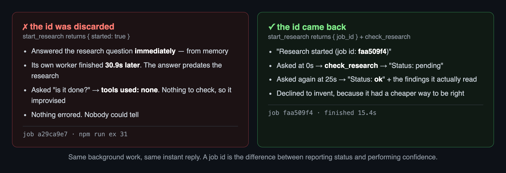

**Run it** · `npm run ex 30`

<!--
Both agents start identical background research. The only difference is one line:
whether start_research returns the job id or throws it away.
Point at the timestamps. The blind agent delivered confident findings 30 seconds
BEFORE its own worker finished, then answered a status question with
"tools used: none". Nothing errored. Nobody could tell.
A claim ticket isn't about latency — both replied instantly. It's the difference
between reporting status and performing confidence.
-->

---

<!-- divider -->

## Part 8 — A runtime

*you've got an agent. Now make it something you can actually use.*

---

# Give it a face

```ts
await runAgentTUI({
  title: "Research Agent",
  agent: researchAgent,          // the same object from the same file
  tools: "auto-collapsed",
  contextSize: 200_000,
});
```

**Why it matters:** this is the bit you can hand to someone. One agent, one thing it's good at.
**Tradeoff:** the TUI won't take an agent with `output:` — chat agents talk; pipelines return objects.

**Run it** · `npm run tui`

<!--
PROTECTED MOMENT 2 — "It's Yours." Everyone runs their own. Ask it something
current, watch it search, press ↑↓ to expand the tool call and read the exact
query the model chose.
Nothing here is new capability — same object, different caller. That IS the
argument for defining the agent as an object: a script called it in exercise 03,
a test could assert on it, and this renders it.
The conversation array is kept for you — that's exercise 22, done automatically.
-->

---

# What to reach for, next time

| Your problem looks like… | Use | You built it |
|---|---|---|
| steps you can name | **chain** | `10` |
| kinds you can name | **router** | `12` |
| steps that don't touch | **fan-out** | `13` |
| work you can't size in advance | **orchestrator** | `15` |
| done you can measure | **evaluator loop** | `14` |
| a step needing its own budget | **subagent** | `16` |
| a second message that knows the first | **two tables** | `22` `23` |
| longer than one reply | **a job** | `30` |
| someone who needs to use it | **a runtime** | `40` |

<!--
The durable takeaway and the client-scoping conversation. This table and the next
slide are what survive the month.
-->

---

# Keep three things

1. **Decide who holds the control flow.** You, or the model. Both are fine; picking by accident isn't.
2. **The six shapes**, and a cap on anything that loops.
3. **The model picks what to remember. Your code picks whose memory it goes in.**

The rest you can look up in an afternoon.

**Next time — the same agent, as a product.** A URL, a chat box that streams, the shapes visible while they run, and the whole thing deployed.

<!--
Aphorism recap, each proven today: an unconnected wire doesn't error (11) · a
loop needs a budget before a goal (14) · the model is stateless (22) · longer
than one reply is a job (30) · the description is the prompt (03).
Then hand over: 8b is the same lib/ they already wrote, wrapped in routes. The
agent doesn't change — only who calls it.
-->
