<!--
FACILITATOR DECK — Module 7: Build Muse's outreach agent. 42 slides.
All screenshots in images/ are from real runs (2026-07-28); all numbers measured.
Each 🤖 box names the file it generates and what that file does, then gives the prompt.
Every filename in a 🤖 box matches a real file in live/ — s1_models, s2_schema,
s3_research, s3b_contrast, s4_vision, s5_image, s6_render, run, list, app. Keep them in
sync: students run these names, and later scripts import earlier ones.
Gotchas and live-demo moments live in these notes, not on slides.
The images/api_*.png slides are crops of the official Responses API reference — they sit
next to the station they explain, so the room sees the doc, not just our wrapper.
-->

# Build Muse's outreach agent

## A partnership one-pager for every prospect — researched, on-brand, in 90 seconds

Muse (rent your closet, NYC) grows by partnering with shops and brands.
Every partnership starts with an outreach one-pager.
Personalized ones win — and cost a designer afternoon each. **We automate that.**

<!--
Open on the business. Generic outreach dies in the inbox; personalized was always better
and always too expensive. Today it becomes a form field. Ask: who does outbound, for
themselves or a client? Two answers — they become capstone prospects.
-->

---

# Watch it once


Typed **Aritzia** → 86 seconds → researched facts, their colors, a custom image, a downloadable PDF.

<!--
Real capture of a real run. Play it live if wifi allows — otherwise this screenshot.
Don't explain internals yet; the session is what's between the input box and this result.
-->

---

# Five parts, and why each one exists

| | You'll learn | Without it, the document… |
|---|---|---|
| **1** | calling the API · choosing a model | doesn't exist at all |
| **2** | typed output — schemas | is prose you can't pour into a layout |
| **3** | web research · reading their site | invents facts and gets their colors wrong — it reads as spam |
| **4** | image generation | uses stock photography — it reads as a mass email |
| **5** | template · PDF · storage · an endpoint | is stuck on your laptop, unsendable |

**Every part is here because the one-pager fails a buyer without it.**

<!--
The agenda as buyer requirements, not technologies — say that out loud. Each row is a
way the document dies in the inbox. Point back to this table at every divider so they
always know which failure they're currently fixing.
-->

---

# The factory line

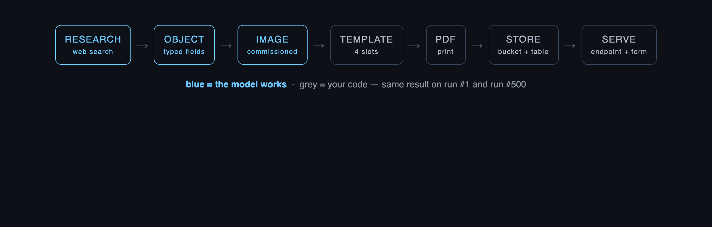

Each part builds **one station**, and the output of one is the input of the next:
research feeds the writing, the writing feeds the image, all of it feeds the page.

**Blue: the model decides. Grey: your code, identical on run 1 and run 500.**

<!--
The spine — returns at each divider. Walk it left to right once, slowly; it's the only
map they get. The blue/grey split is the session's real argument: creativity where you
want variation, code where you want none. S5 callback: "push determinism outward."
M6 callback: "describe the shape, let a model fill it" — that's the OBJECT station.
-->

---

<!-- divider -->

## Part 1 — Talk to the model

*Nothing else works until words come out of the API. Start there, and learn what they cost.*

---

# One endpoint, a family of models

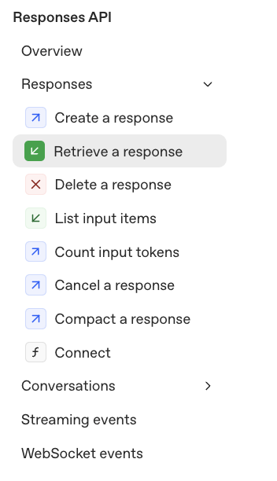

Everything today goes through **one call** —
`client.responses.create`.

What changes is the **model** you name inside it.

Larger models reason harder and cost more.
Smaller ones are fast and cheap.
Separate models make the images.

`client.models.list()` prints the ones your key can call today.

<!--
Open Part 1 on the docs, not on our code. The sidebar IS the whole Responses API — point
at it and say: you are not learning an SDK, you are choosing a model and writing a
prompt. Everything after this slide is that one call with different arguments.
Why models.list() matters: names rotate every few months. The list is durable; the names
in any tutorial are not, including the ones on the next slide.
-->

---

# Same question, three models, three prices

```python
r = client.responses.create(model="gpt-5.6-terra", input=brief)
```

| Model | $/1M in · out | Use for |
|---|---|---|
| `gpt-5.6-sol` | $5 · $30 | hardest reasoning |
| `gpt-5.6-terra` | $2.50 · $15 | **today's workhorse** |
| `gpt-5.6-luna` | $1 · $6 | drafts, volume |

**🤖 → `s1_models.py`** — asks all three the same question and prints what each answer cost:

```text
Write s1_models.py: load OPENAI_API_KEY from .env, list the models available to the key,
then send the same one-sentence brief about Muse to gpt-5.6-luna, -sol and -terra with
client.responses.create and print each model's token usage. Expect three rows.
```

**Run it** · `python s1_models.py`

<!--
First build, 5 minutes. The prompt-box motion, said explicitly: you decide the models
and the expectation; Claude Code writes the plumbing; you verify the rows.
Why it matters commercially: choosing terra over sol across ten thousand prospects is a
four-figure decision. That's the whole reason this is Part 1.
-->

---

# Measured, on your own terminal

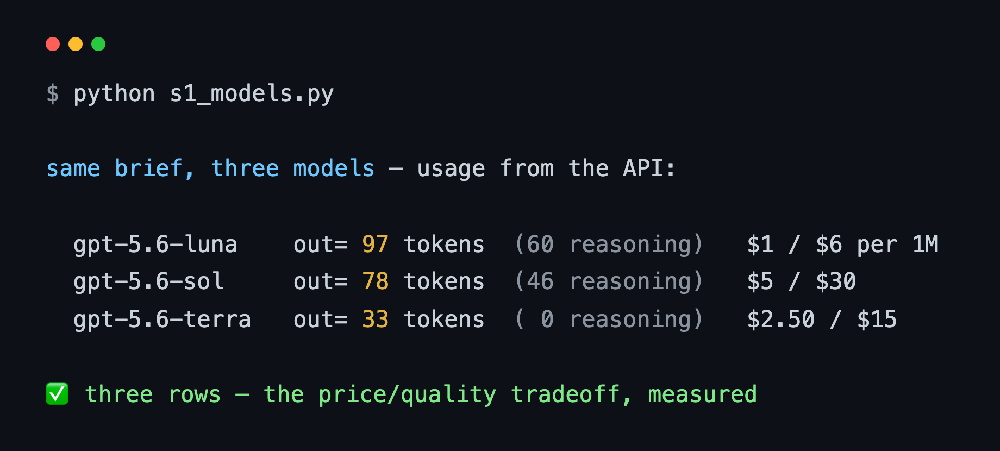

**The model you pick is a cost line on your client's quote.** And the cheap one is not
always cheaper per *answer* — look at the reasoning column.

<!--
✅ Checkpoint: three rows. Don't explain the reasoning number yet — the next slide does.
-->

---

# Thinking is a setting, and it's billed

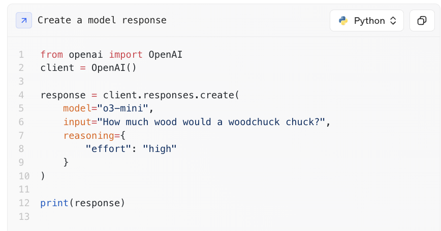

Stronger answers **think before they write**. Those thinking tokens never reach you —
and you pay for them anyway. `reasoning={"effort": …}` turns that up or down.

<!--
This closes the previous slide: luna spent 73 reasoning tokens on a one-liner, terra
spent 0 — the price/quality tradeoff, visible in their own terminal.
Effort replaced the old sampling knobs. If someone asks about temperature: reasoning
models reject it with a 400 that says so. Answer it out loud — it doesn't need a slide.
-->

---

<!-- divider -->

## Part 2 — Output your code can use

*The words are good. But they arrive as one paragraph, and a template can't read a paragraph — it needs the headline, the three bullets, the button text and the colors as separate, named values.*

---

# Describe the page as classes

```python
class Brand(BaseModel):
    palette: list[str]   # "2-4 hex colors from the prospect's identity"
    tone: str

class WhyUs(BaseModel):
    title: str
    bullets: list[str]   # "exactly 3, each grounded in a researched fact"

class OnePager(BaseModel):
    headline: str        # the h1
    hero: HeroImageSpec  # the image brief (Part 4 executes it)
    why_us: WhyUs
    cta: CTA
    brand: Brand
    sources: list[str]   # the receipts (Part 3 fills them)
```

The comments are real `Field(description=…)` strings — **the model reads them as instructions.**

<!--
This IS the design step: the class tree mirrors the page (next slide shows the mapping).
Descriptions steer generation — "exactly 3 bullets, each grounded" is a spec the model
follows. Nested, because documents are trees: why_us owns its bullets, brand owns its
palette. This one class will feed the API call, the HTML template, and the database row.
-->

---

# The same five names, on the page

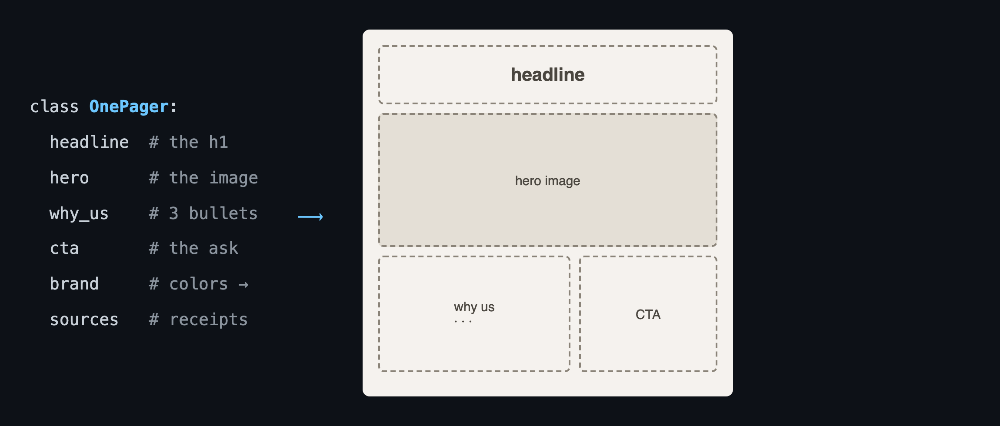

**🤖 → `s2_schema.py`** — the classes from the previous slide, plus one call that proves the shape:

```text
Write s2_schema.py: nested Pydantic classes for a one-pager — OnePager(headline, hero:
HeroImageSpec with an image_prompt creative brief, why_us: WhyUs with exactly 3 grounded
bullets, cta: CTA, brand: Brand with hex palette + tone). Every field gets a
Field(description=…) written like a spec. Then one responses.parse call with a hardcoded
FINDINGS string, guarded by if __name__ == "__main__" so later scripts can import the
classes without re-running it. Save onepager.json.
```

**Run it** · `python s2_schema.py`

<!--
Schema on the left, page on the right, one vocabulary. When the layout is the schema,
"on-format every time" stops being a hope — the template can only render what the shape
provides. Why it matters: this shape is the product spec a client signs off on.
-->

---

# One call, typed out

```python
from s2_schema import OnePager        # every later script imports this one tree

r = client.responses.parse(model="gpt-5.6-terra",
                           input=brief, text_format=OnePager)

r.output_parsed.headline         # → "Muse × Reformation: …"
r.output_parsed.brand.palette    # → ['#1a1a1a', '#f5f2ee', …]
r.output_parsed.why_us.bullets   # → a real Python list of 3
```

**✅ Checkpoint: `type(r.output_parsed)` prints `OnePager` — fields, not prose.**

**Why it matters:** template, image and database read these exact attributes — no string-parsing, ever.
**Tradeoff:** you design the shape up front — which is exactly the thinking a client pays for.

<!--
parse() takes the class and returns an instance; the API guarantees the shape (every
field present, nothing extra) — that guarantee is why the pipeline runs unattended.
Live aside if the room asks: add a lazy `extras: dict` field and watch the API decline
vague shapes — strictness is the feature.
-->

---

<!-- divider -->

## Part 3 — Make it true, make it theirs

*The shape is right, but the model is filling it from memory — inventing plausible facts and guessing their colors. A buyer spots that in five seconds. So we go and look.*

---

# The difference research makes

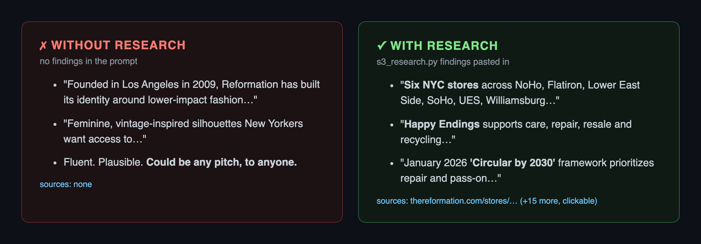

**Same model, same schema, *neither* call searches** — the only variable is the findings.

**🤖 → `s3b_contrast.py`**:

```text
Write s3b_contrast.py: import OnePager from s2_schema. Two responses.parse calls, same
model, same text_format, no tools — one with no findings, one with research.json's
findings plus 'ground every claim, never invent facts'. Save the grounded one as
onepager.json.
```

**Run it** · `python s3_research.py` **then** `python s3b_contrast.py`

<!--
THE SLIDE OF THE SESSION. Both columns real — same schema, same model. The left is the
dangerous kind of wrong: fluent, plausible, generic. A buyer spots template outreach in
five seconds, and your client's name is on it. Sit here.
Run order matters: s3_research.py writes research.json, s3b reads it — s3b alone dies on
a missing file. Worth saying, because the contrast is the thing they'll want to re-run.
If someone's s3b prints a Reformation one-pager BEFORE the two columns, their s2_schema
demo call isn't guarded by __main__ — importing the shape is re-running the call, and
billing them for it. Common enough to watch for.
-->

---

# Search once. Keep the findings.

```python
r = client.responses.create(model="gpt-5.6-terra",
        tools=[{"type": "web_search"}],   # ← this is the call that searches
        input=research_brief)             # ← findings out, citations attached
```

**🤖 → `s3_research.py`** — the research half, saved to `research.json`:

```text
Write s3_research.py: one responses.create with tools=[{'type':'web_search'}] asking it
to research the prospect (NYC retail presence, resale/circular programs, brand
aesthetic, one recent initiative) and cite sources. Print the findings, then walk
r.output for url_citation annotations and print each title + URL. Save findings and
sources to research.json.
```

**Run it** · `python s3_research.py`

**Why separate it?** One paid search, then as many rewrites as you like off the same
findings — and it's what makes the previous slide a fair test.

<!--
Answer the obvious question before it's asked: s3b does NOT search. The searching happens
here, once, and lands in research.json. s3b then makes two identical calls that differ
only in whether those findings are in the prompt — change one variable, not two.
In Part 5, app.py FUSES the two: a single responses.parse carrying BOTH
tools=[web_search] and text_format=OnePager, so the endpoint is one call per prospect.
Split to teach and to A/B; fused to ship. Say it here so compose() isn't a surprise.
Cost: ~13¢ and ~30s for the search. A researcher doing the same: an hour.
-->

---

# Not our trick — it's one line in their docs

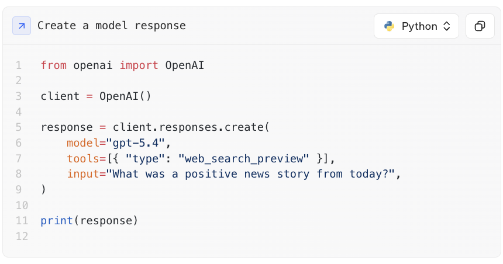

**`tools=[…]` is a list you hand the model.** It searches when it decides it needs to;
you never write the search code, the pagination, or the scraping.

<!--
Put the official page up so the room sees this is a first-class API feature, not a
workaround we invented. Two things to say: the docs example is a plain create() and ours
is a parse() with text_format — search and typed output compose, you don't pick one.
And their example model is older than terra; the TOOLS LIST is the durable part.
-->

---

# The answer is a list of steps, not a string

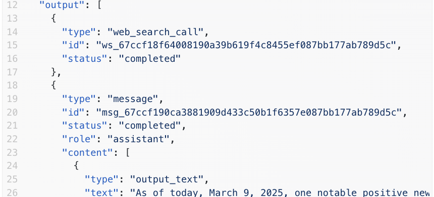

`output` is everything the model *did*: the **`web_search_call`**, then the **`message`**.
Walking that list is how `s3_research.py` pulls the citations out — the URLs live in the
message's `annotations`, which is why every claim on the one-pager can be checked.

<!--
This is the slide that makes the citation loop stop looking like magic:
  for item in r.output:
      if item.type == "message": ...annotations → url_citation
They will see this exact shape when they print a response and wonder why it isn't a
string. It isn't a string because the model took steps, and the API shows its work.
Callback at the Part 5 sources field: THIS is where those receipts come from.
-->

---

# What comes back

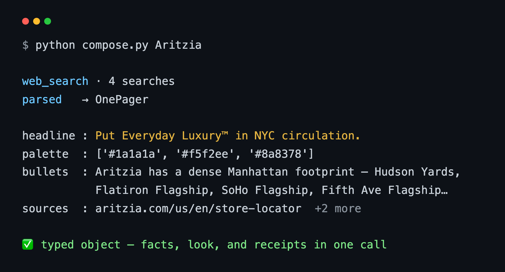

**✅ Checkpoint: click a source — it's the prospect's actual store locator.**

<!--
Real Aritzia run: four searches, the trademarked "Everyday Luxury™" found on its own,
store-locator URL in sources. The clickable source is also what the buyer spot-checks.
-->

---

# Their look — how it actually works

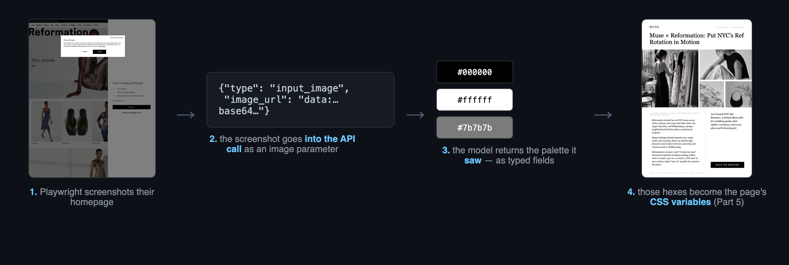

**🤖 → `s4_vision.py`** — screenshots the homepage, sends the *image itself* to the model, gets typed colors back:

```text
Write s4_vision.py: Playwright-screenshot the prospect's homepage to prospect_home.png,
then pass it to responses.parse as an input_image content part (base64 data URI, detail
'low') with a typed format holding the 2-4 hex colors actually visible, the tone in 3-6
words, and a one-sentence art direction that describes framing and light only — never
models or people. Print the palette and save brand_visual.json.
```

**Run it** · `python s4_vision.py`

<!--
Four steps on the diagram — walk them left to right: M6's screenshot skill, the image AS
an API parameter, typed hexes out, CSS variables in Part 5. The punchline from the run:
asked to GUESS Reformation's palette the model said warm cream; SHOWN the site it said
monochrome — correct. Looking beats guessing; this is grounding for aesthetics.
-->

---

# A picture is just another content part

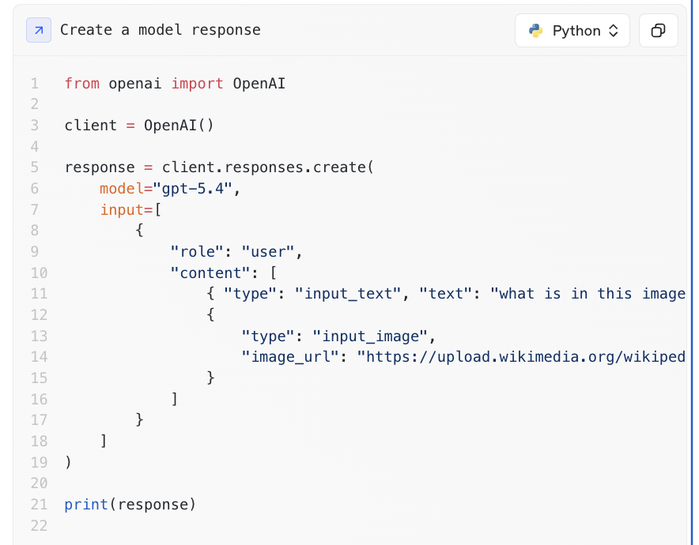

`input_text` and **`input_image`** sit side by side in the same list. That's the whole
mechanism — no vision endpoint, no separate model.

<!--
The docs pass a public image_url; we swap in a base64 data URI of the Playwright
screenshot, because the prospect's homepage isn't a Wikipedia file. Same field.
Say it plainly: "the image is a parameter" is the sentence to remember — it's what makes
s4_vision.py four lines instead of a project. detail:'low' is a cost dial; palettes
don't need high.
-->

---

<!-- divider -->

## Part 4 — The image

*The facts and the colors are real. The picture is still the giveaway: a stock photo tells the buyer this went to five hundred people.*

---

# Commissioned, not stock

```
research  →  brand fields  →  image brief  →  gpt-image-2
```

The brief already exists — it's `op.hero.image_prompt`, written by the text model *from the research*.

**🤖 → `s5_image.py`** — turns that field into a PNG:

```text
Write s5_image.py: read onepager.json and brand_visual.json, build the image brief from
hero.image_prompt + palette strictly + art direction + 'still life only, no people, no
text or logos', call client.images.generate(model='gpt-image-2', size='1536x1024',
quality='medium') and save the decoded b64_json as hero.png. Catch a moderation_blocked
error and retry once on a stripped-down brief.
```

**Run it** · `python s5_image.py`


<!--
Image models: separate product class, same client, priced per image token. The chain is
the point — every arrow is a station already built. Quality is a dial: low while
iterating, medium+ for the handout.
-->

---

# The hero, and its price


**~4¢ · ~60s** — 1,372 image tokens at $30/1M.

<!--
✅ Checkpoint: an image that visibly belongs to the prospect's world. If asked why not a
one-line prompt: the brand-fed brief is the difference between this and generic stock —
brief quality IS image quality.
-->

---

<!-- divider -->

## Part 5 — Ship the document

*Everything so far lives in Python variables. A buyer can't be sent a variable — they need a PDF at a link that works from anyone's browser.*

---

# The template reads the fields

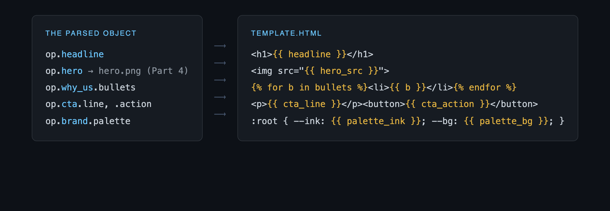

**🤖 → `template.html` + `s6_render.py`** — the page as code, and the lines that fill and print it:

```text
Write template.html (Jinja2): one Letter page — wordmark header, <h1>{{ headline
}}</h1>, full-bleed hero , two columns (why-us bullets | CTA line + button),
palette as CSS variables. Then s6_render.py: read onepager.json, brand_visual.json and
hero.png, sort the palette by brightness into ink / accent / background,
Template(...).render(...) into onepager.html, and print onepager.pdf with Playwright at
8.5×11in, print_background=True.
```

**Run it** · `python s6_render.py`

<!--
The missing link, now explicit: object attribute → Jinja slot → printed pixel, same five
names end to end. The model never touches this file — that's why run #500 is on-format.
Say before they render: print_background=True or Chromium strips the colors for print.
-->

---

# The template lights up


<!--
✅ Checkpoint: a PDF you would physically hand a buyer. Let the slide breathe — words,
image and palette snap into one artifact here. The colors on this page are the hexes
from s4_vision.py, via three CSS variables.
-->

---

# First, make somewhere to put it

Run once in **Supabase → SQL Editor**:

```sql
-- the bucket holds the bytes: the PDF and the hero image
insert into storage.buckets (id, name, public)
values ('ai-workshop', 'ai-workshop', true)
on conflict (id) do nothing;

-- the table holds the record of what was made
create table if not exists onepagers (
  slug       text primary key,   -- "Aritzia" → aritzia
  payload    jsonb not null,     -- the whole OnePager object
  sources    jsonb,              -- the receipts
  created_at timestamptz default now()
);
```

**`slug`** is the prospect's name, lowercased and hyphenated — the filename, the primary key, and the reason re-running a prospect **replaces** it instead of piling up copies.

<!--
`public: true` means anyone with the link opens the PDF without logging in. That is the
point — you're pasting it into an outreach email.
Someone always asks about RLS: the service key bypasses it, so no policies are needed for
this. That's also why the service key never goes near a browser.
on conflict / if not exists so they can paste it twice without an error.
-->

---

# Save it where links come from

```python
sb.storage.from_("ai-workshop").upload(name, pdf_bytes,
    file_options={"content-type": "application/pdf", "upsert": "true"})
```

**Bucket** → the bytes → a public URL · **Table** → the record of what was made, when, from what.
**`store(slug, op)`** does both, and **hands back the public URLs**.

**🤖 → a `store()` function, and `list.py` to read it back:**

```text
Write a store(slug, op) function: upload hero + PDF to the Supabase ai-workshop bucket
(content-type set, upsert 'true' as a string), upsert a onepagers row (slug, payload
JSON, sources) on conflict slug, and **return the public URL of each upload**. Then
list.py: print every row in the table with its headline and its public PDF URL. Creds
from env; add the names to .env.example.
```

**Run it** · `python list.py`

<!--
M6 callback: they have tables; buckets complete the pair. The URL is the deliverable;
the row is the record (Module 10 evals read these rows). Say while they build: upsert
value is a string; content-type or the PDF serves as text; load_dotenv(override=True)
if a shell-exported SUPABASE_URL shadows the .env.
Make them return the URL, not just True — otherwise the bytes are in Supabase and the
only link they have points at their own laptop. list.py is the proof it round-trips.
store() ships inside app.py so the endpoint and run.py share one definition.
-->

---

# The whole line, one command

```bash
python run.py "Everlane" https://www.everlane.com
```

```
  [1/5] look     palette #F8F7F5 #222222 #5A5A5A        9s
  [2/5] compose  6 sources, typed OnePager             49s
  [3/5] paint    output/everlane_hero.png              99s
  [4/5] render   output/everlane.pdf                  100s
  [5/5] store    saved to Supabase                    102s
```

**🤖 → `run.py`:**

```text
Write run.py: take the prospect name and homepage as command-line arguments, import the
five station functions rather than redefining them, call them in order, and print each
station as it finishes with elapsed seconds. At the end print the headline, the three
bullets, the sources and the public Supabase URLs.
```

<!--
✅ Checkpoint: five lines, then a link that works from anyone's browser. This is the
command the capstone runs — no server, no second terminal, nothing to keep alive.
The import is the lesson: run.py doesn't reimplement anything, it just walks the same
five functions the endpoint walks. One definition, two front doors.
Real numbers on this slide — an actual Everlane run, 102s, ~20¢.
-->

---

# `run.py` is you. An endpoint is everyone else.

**Muse's sales team doesn't have your laptop, your terminal or your keys.**

| | `python run.py` | `POST /onepagers` |
|---|---|---|
| who can trigger it | you, at a keyboard | a form · a CRM · Zapier · an agent |
| needs Python? | yes | no — anything that speaks HTTP |

**Nothing new is written** — the same five functions, with a decorator on top:

```python
@app.post("/onepagers")
def create(req: Request_):          # {"prospect": ..., "homepage": ...}
    visual = look(req.homepage)     # Part 3
    op     = compose(req.prospect)  # Part 3
    paint(op, visual)               # Part 4
    render(op, visual)              # Part 5
    store(op)                       # Part 5
    return {"headline": op.headline, "pdf_url": url, "seconds": t}
```

<!--
The seam of the whole program, so say it plainly: a script is something YOU run; an
endpoint is something a COMPANY runs. Same five functions, different door.
Point at the five calls and match them to run.py's five printed stations — literally the
same code, which is why neither file reimplements the other.
POST specifically: you're asking the server to CREATE something (a new one-pager) and
sending data with the request. GET, next to it, only reads what already exists. That's
the whole distinction — POST makes, GET fetches.
FastAPI reads the Pydantic Request_ model straight from the POST body — the same trick as
text_format, pointed at HTTP. M8 builds the real product on this seam.
-->

---

# Refresher: a server is a program that doesn't finish

Every script so far: **start → do the work → print → exit.**
A server: **start → wait → answer → wait → answer →** …forever, until you stop it.

- **uvicorn** is that waiting program. It holds **port 8000** open and listens.
- A request arrives, uvicorn hands it to your Python function, your return value goes back out.
- `localhost:8000` means *this machine, door 8000*. Swap `localhost` for a real domain and nothing else changes — that's how this reaches Railway later.

**Your terminal will look frozen. That's it working.**

<!--
Say the frozen-terminal line before they ever run it, or half the room reports a bug.
The port is worth one sentence: one program per door. "Address already in use" means
something is still on 8000 — usually their own earlier uvicorn. lsof -ti:8000 | xargs kill.
Ctrl-C stops it. This is also the first program they've written that has to be SHUT DOWN,
which is a genuinely new idea for a lot of them.
-->

---

# What FastAPI actually does

```python
@app.post("/onepagers")       # verb + path — this decorator IS the wiring
def create(req: Request_):    # a Pydantic class = the JSON body it accepts
    return {"headline": ...}  # your dict comes back as the JSON response
```

- **Pydantic, again.** A malformed body is rejected before your code runs — the same trick as `text_format`, pointed at HTTP instead of at the model.
- **Uvicorn** is the server that keeps it listening. FastAPI defines the routes; uvicorn answers the port.
- **Free at `/docs`** — every route, self-documenting:

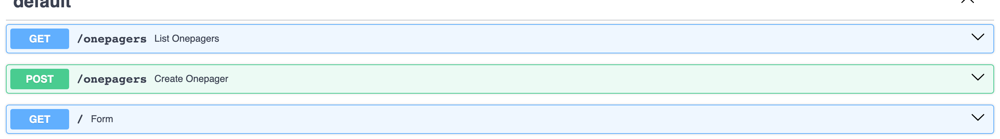

<!--
Concise on purpose: three ideas — decorator wires it, Pydantic guards it, uvicorn serves it.
The Pydantic callback is the one to land: they already used a Pydantic class to constrain
the MODEL's output in Part 2; here the identical mechanism constrains the CALLER's input.
One idea, two ends of the pipe.
Open localhost:8000/docs live if you have a minute — clicking "Try it out" on POST
/onepagers and watching it run is the cheapest way to show an endpoint is a real product.
Keep FastAPI vs uvicorn straight or the next slide's command reads as magic.
-->

---

# So what happens when you POST?

1. `curl` sends `{"prospect": "Aritzia", …}` to port 8000.
2. **uvicorn** takes it off the wire and hands it to FastAPI.
3. **FastAPI** sees `POST` + `/onepagers`, checks the body against `Request_`, calls `create()`.
4. `create()` runs the five stations **in order, in one Python process** — look → compose → paint → render → store. This is the ~90 seconds.
5. It returns a dict. FastAPI turns that into JSON and sends it back to `curl`.

**It is not running your `s3_research.py` and `s5_image.py` files.** Those were the teaching
versions. `app.py` holds one copy of each station as a function — the same five `run.py` calls.

<!--
Answer the question they're all silently asking: no, the endpoint does not shell out to the
s-scripts. Same logic, one copy, living in app.py. The s-scripts taught the stations; app.py
and run.py both just call them.
Step 4 is where the wait lives — nothing prints, because the printing happens inside the
functions and goes to the SERVER's terminal, not curl's. Tell them to watch the uvicorn tab.
-->

---

# Start the server, then knock on it

**Leave this running:**

```bash
uvicorn app:app --port 8000 --reload
```

**In a second tab:**

```bash
curl -X POST localhost:8000/onepagers \
  -H "Content-Type: application/json" \
  -d '{"prospect": "Aritzia", "homepage": "https://www.aritzia.com"}'

curl localhost:8000/onepagers     # GET — everything made so far
```

**🤖 → `app.py` + `index.html`:**

```text
Write app.py (FastAPI): POST /onepagers takes {prospect, homepage}, runs the five
stations, returns {headline, seconds, sources, pdf_url}. Add GET /onepagers reading the
table back. Serve index.html at / — a two-field form that fetch()es the endpoint.
```

<!--
Say the mental shift out loud: every script so far started, did the work, and exited.
uvicorn does NOT exit — that's not it hanging, that's it waiting for callers. They will
think it's broken. Warn them first.
--reload restarts on save, so they can edit app.py while it runs.
curl before the form, always: the endpoint is the product, the form is just its first
customer — and the form's fetch() sends EXACTLY this JSON body to exactly this route.
The 86s wait is real; the terminal looks frozen. Then localhost:8000 in a browser for the
form. (The Dockerfile in the repo runs this same service on Railway — M10's MCP calls it.)
-->

---

# The whole line, behind one input box

**Open** `localhost:8000` — the same server, now serving the form:

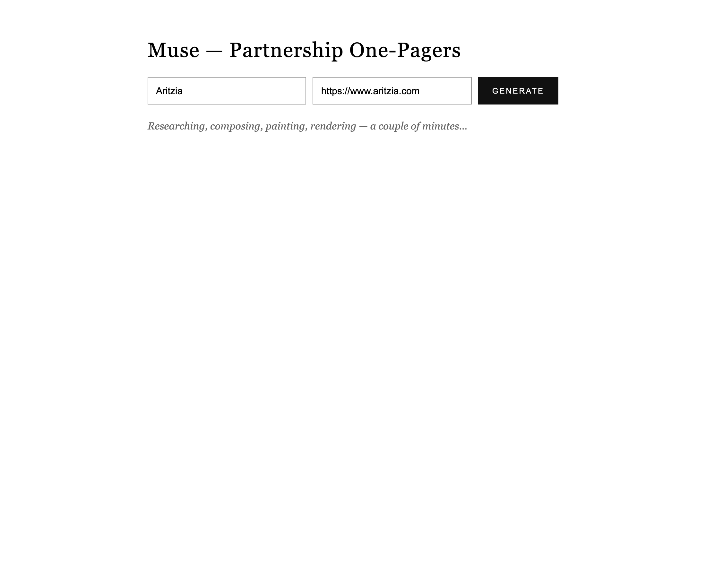

<!--
PROTECTED MOMENT (~2:25). Someone types a brand name; every station they built today
fires in sequence. Stop talking while it runs — 86 seconds is the right length of
silence.
-->

---

# 86 seconds later

**✅ Typed a name → researched, branded, printable, stored. ~20¢.**


<!--
Measured on the run this screenshot came from: "Done in 86.1s — 'Put Everyday Luxury™ in
NYC circulation.'" It found their trademarked slogan on its own.
-->

---

# Nothing changed but the input

Sézane through the same endpoint — Conciergerie repairs, "Heritage Pieces" buy-back, 254 Elizabeth St, a Parisian-apartment hero:


<!--
The generalization proof — same code, same schema, same template; different prospect,
different facts, different look. Reformation and Aritzia ran through it too: six
artifacts, three prospects, one pipeline. This slide is the capstone's pitch.
-->

---

# What you should have in the folder

| File | What it does | Part |
|---|---|---|
| `s1_models.py` | prices the model family · the temperature 400 | 1 |
| `s2_schema.py` | the nested classes · one typed call | 2 |
| `s3_research.py` | web_search → findings + citations → `research.json` | 3 |
| `s3b_contrast.py` | the same schema with and without the research | 3 |
| `s4_vision.py` | screenshot → `input_image` → `brand_visual.json` | 3 |
| `s5_image.py` | the brief → `gpt-image-2` → `hero.png` | 4 |
| `template.html` + `s6_render.py` | the fields → the page → `onepager.pdf` | 5 |
| `run.py` · `list.py` | the whole line, one command · read Supabase back | 5 |
| `app.py` + `index.html` | the same five stations behind a URL | 5 |

<!--
The replication checklist — put it up during build time and leave it up. Run order is
top to bottom; s3b needs s3's research.json, s5 needs s2's onepager.json and s4's
brand_visual.json, s6 needs hero.png. If someone is lost, ask which file they're missing
rather than which concept.
-->

---

# Capstone: your prospect

Pick a real shop or brand **you** would pitch Muse to. Then, in your own terminal:

```bash
python run.py "Their Brand" https://theirsite.com
python list.py
```

Now judge it the way their buyer would:

1. **Click one source.** Is it real, and does it say what the bullet claims?
2. **Read the three bullets aloud.** Could they have been written about any other brand?
3. **Open the PDF from the Supabase URL.** Would you put your name on this email?

<!--
Every step maps to a part built today — say the mapping out loud as they go.
Share-around at 2:50: three students present, the room judges on question 2. That
question is the one Module 10 turns into an automated eval.
Keep a shortlist of strong prospects ready — a brand with a thin web presence produces
thin bullets, and that's the pipeline being honest, not broken. Say so before they pick.
Each run is roughly 20¢ on their own key.
-->

---

# Three things to keep

1. **Ground before you generate** — research first, or the schema fills with confident, generic copy
2. **Shape first** — design the document as typed fields; API, template and database read the same names
3. **Model owns the words and the picture; code owns the layout** — that's why every run ships

<!--
Everything else is recoverable in an afternoon. Close the loop: re-show slide 2 and
narrate it as stations — research (P3), typed object (P2), image (P4), template/PDF/URL
(P5). The room should be able to name every stage now.
-->

---

# Go build

**HANDOUT.md** — every step, every prompt, full code
**GUIDE.md** — the concepts, after

Next session: this endpoint gets users —
login, chat, and an agent that decides *when* to run your line.

<!--
M8 tease: today one form calls one endpoint; next time it's a real product with accounts
and an agent choosing when to call the factory line. Leave this up during Q&A.
-->
