<!-- _class: lead -->

# Session 8b — One agent, many ways to use it

## Build the agent once, put it behind a URL — then connect anything to it

<!-- Room settling. Nothing to explain yet — the next slide does the selling. -->

---

## Where we end up today

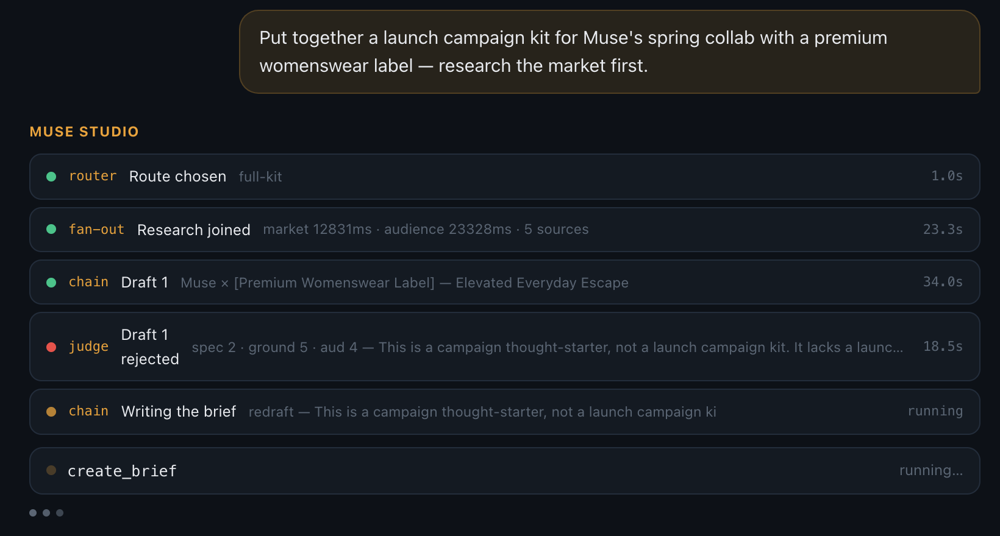

**This chat page was built today, for a tiny one-tool agent. Here it's running last week's five-tool agent — the only thing I changed was the URL it points to.**

<!--
Play this straight, unexplained. What they're seeing: a chat page rendering a
five-tool agent's pipeline — router, research fan-out, a JUDGE REJECTING a
draft in red, a redraft — live. Don't defend it. Move on.
-->

---

## Today's map

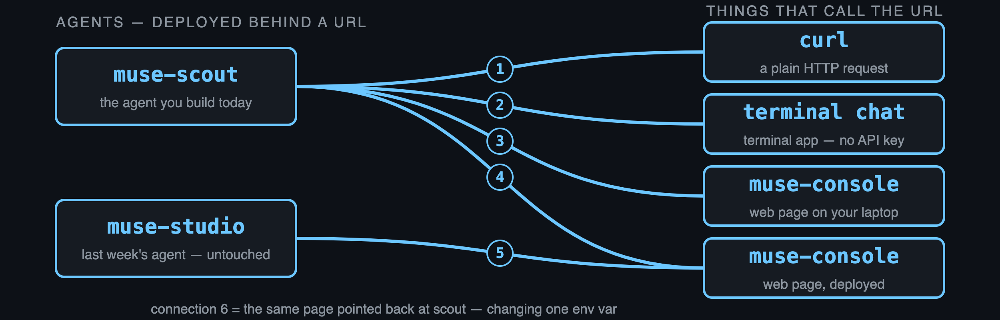

**Two deployed agents, four different things calling them — six connections. We'll count them again at the close.** *This picture comes back at every step, so you always know where we are.*

<!--
Draw this on the whiteboard NOW, exactly: agents left, callers right. This
drawing returns at every divider with one connection lit. Nothing else gets
drawn today.
-->

---

## Today's objectives

In one breath: **an agent is just code — wrap it in an API endpoint, deploy it to a URL, and anything that can make a web request can use it.**

| # | Objective | Steps | Without it |
|---|---|---|---|
| 1 | Test the agent in a local UI | 01 | you can't trust what you never ran |
| 2 | Deploy it to production — prove it with curl | 02–04 | laptop code is a demo, not a product |
| 3 | Add a UI to start the agent | 05–06 | customers won't use a terminal |
| 4 | Store data from agent interactions | 07–08 | refresh forgets; long jobs time out |
| 5 | Swap the agent behind the UI | 09–10 | the product dies with its first agent |

<!-- Read the third column out loud — the room should always know which problem we're fixing. -->

---

<!-- _class: lead -->

## Step 01 — First, the agent itself

*15 lines that run on your laptop — no server involved yet*

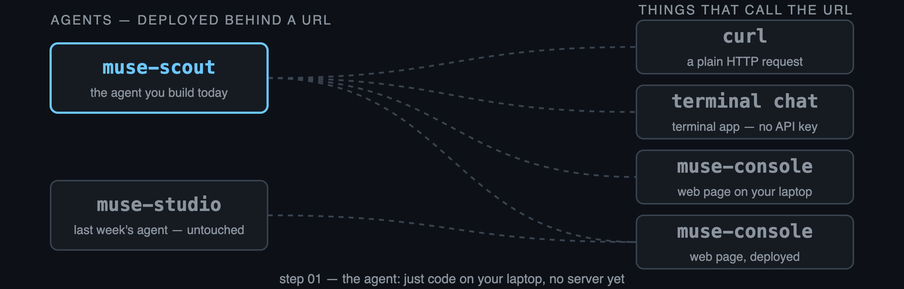

---

## Here's the whole agent

```ts
import { ToolLoopAgent, isStepCount } from "ai";
import { openai } from "@ai-sdk/openai";

export const scoutAgent = new ToolLoopAgent({
  model: openai("gpt-5.6-terra"),
  instructions: "You are Muse Scout, a research agent. Search before answering…",
  tools: { web_search: openai.tools.webSearch({ searchContextSize: "low" }) },
  stopWhen: isStepCount(4),
});
```

A model, instructions, one tool, and a step budget — that's an agent. It runs on your laptop and nowhere else. **Next: we wrap it, so the world can reach it.**

<!-- Hand-typed, together, slowly. Model + instructions + tools + budget: that's an agent. -->

---

## How the agent gets wrapped

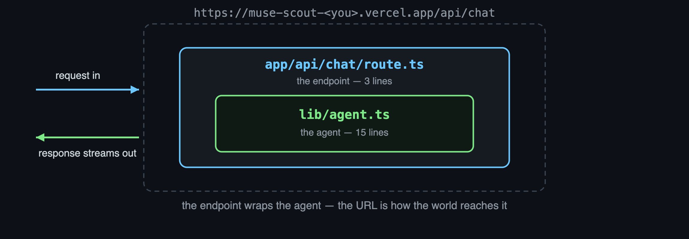

**The endpoint wraps the agent; the URL is how everything reaches it.** Every step today plugs something new into this picture.

---

## Generate the backend with Claude Code

**Prompt → `backend/`** — a Next.js app with no pages, plus a terminal chat for the agent:

```text
Scaffold a minimal Next.js 16 App Router app in backend/ (no pages, API only),
pinned to: ai@7.0.52, @ai-sdk/openai@4.0.30, next@16.2.12, react@19.2.8, zod@4.
Add lib/agent.ts (I'll paste mine), an exercises/01-tui-local.ts that runs
runAgentTUI({ agent }) from @ai-sdk/tui@1.0.53, and npm scripts: tui, ex.
Env: OPENAI_API_KEY in .env.local, names documented in .env.example.
```

**Run it** · `npm run tui`
*(the version pins are the tested build of 2026-08-05 — they match the repo's package.json; re-pin when you re-test)*

---

## ✅ It decided to search on its own

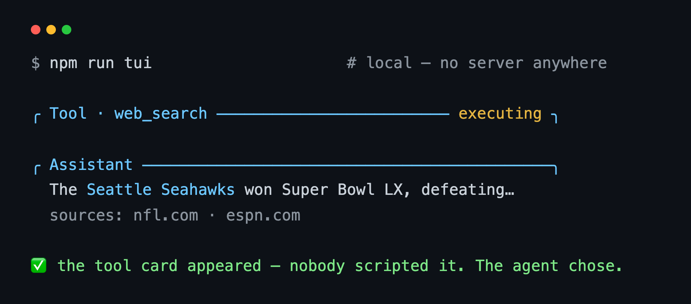

**Notice: there's no server here.** The agent is running as plain code inside your terminal. In ten minutes, an API endpoint will serve this exact same object.

<!--
Protected Moment #1 setup: everyone asks something post-cutoff. The tool card
appears WITHOUT anyone scripting it — the agent decided. Let that land.
-->

---

<!-- _class: lead -->

## Step 02 — Wrap it in an API endpoint

*right now, you are the only person on Earth who can run this agent*

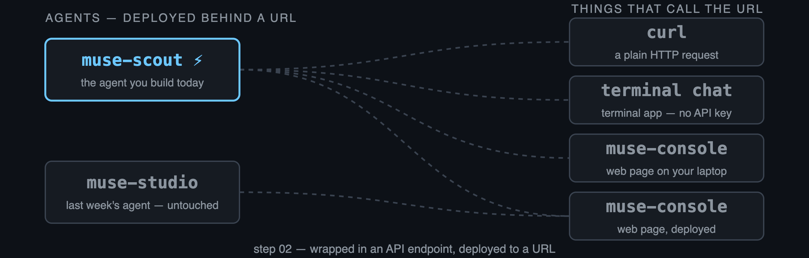

---

## Three lines turn it into an endpoint

This file is the entire backend — `backend/app/api/chat/route.ts`:

```ts
import { createAgentUIStreamResponse } from "ai";
import { scoutAgent } from "@/lib/agent";

export async function POST(req: Request) {
  const { messages } = await req.json();
  return createAgentUIStreamResponse({ agent: scoutAgent, uiMessages: messages });
}
```

Read it as a story: **a POST request arrives carrying the chat messages → that kickstarts the agent (tools and all) → the response streams back as the answer is being written**, instead of making the caller wait for the whole thing. **Tradeoff:** once this URL is public, every call spends your OpenAI key — real auth is the capstone's honest answer.

---

## Deploy it: GitHub, then Vercel

1. Create the repo and push:
```sh
git init -b main && git add -A && git commit -m "muse-scout"
gh repo create muse-scout --private --source=. --push   # or github.com/new + git remote add + push
```
2. [vercel.com/new](https://vercel.com/new) → Import repo → **Root Directory = `backend/`**
3. Add the environment variable `OPENAI_API_KEY` — *the key lives on the server, never in git* → Redeploy
4. From now on, deploying = `git push`. Vercel rebuilds on every push.

**Run it** · `curl https://muse-scout-<you>.vercel.app/api/health`
**Expect** · `{"ok":true,"service":"muse-scout"}`

<!--
GOTCHA #1, out loud, now: the root URL 404s — that's CORRECT. An API-only app
has no pages. The health route exists so there's something to see.
Walk the dashboard slowly on the projector; this is config, not code.
-->

---

<!-- _class: lead -->

## Step 03 — Call your agent from anywhere

*it has a public URL now — let's actually use it*

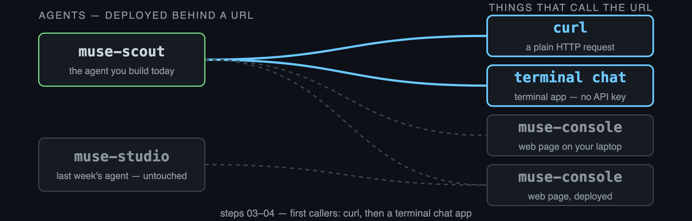

---

## First call: Vercel answers instead of your agent

**Run it** · `curl -sI https://muse-scout-<you>.vercel.app/api/health`

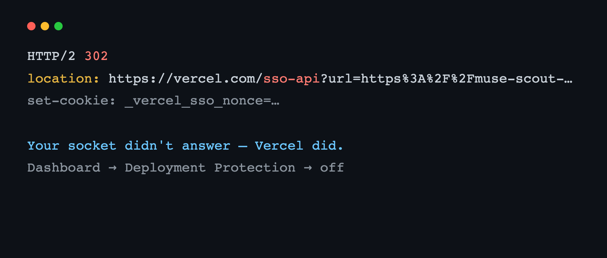

**New Vercel projects ship with Deployment Protection turned on** — a login wall in front of your URL. Turn it off in the dashboard. *Lesson worth keeping: read what actually came back, not what you expected back.*

<!--
FAILURE BEAT ① — let them hit it. Everyone curls, everyone gets the 302, ~30
seconds of confusion, then read the location header together. This is the
day's gentlest beat.
-->

---

## Start a chat from your terminal

One HTTP POST starts the agent — the exact call the web page makes later:

```sh
curl -N -X POST https://muse-scout-<you>.vercel.app/api/chat \
  -H 'content-type: application/json' \
  -d '{"messages":[{"id":"m1","role":"user","parts":[{"type":"text","text":"What happened in AI news today? Two lines, with sources."}]}]}'
```

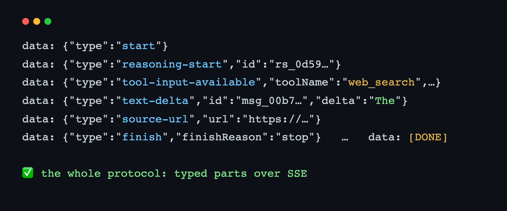

**Labeled events stream back — `-N` tells curl not to buffer.** *And no API key, no agent code: just the URL.*

<!--
The money moment of the morning. Scroll it slowly. Name the types as they pass.
(`sh clients/curl-wire.sh` is this same command saved as a script.) Add
"id":"my-conv-1" beside "messages" and the backend remembers the conversation —
that's step 07's hook. For the curious: clients/tui-remote.ts is a full terminal
chat app, zero keys in its package.json. Optional exercise, not taught.
-->

---

## Step 04 — Watch it run in production

```ts
onStepEnd({ stepNumber, usage, finishReason }) {
  console.log(`[scout] step ${stepNumber} · ${JSON.stringify(usage)} · ${finishReason}`);
}
```

**Run it** · `vercel logs muse-scout-<you>.vercel.app --follow`

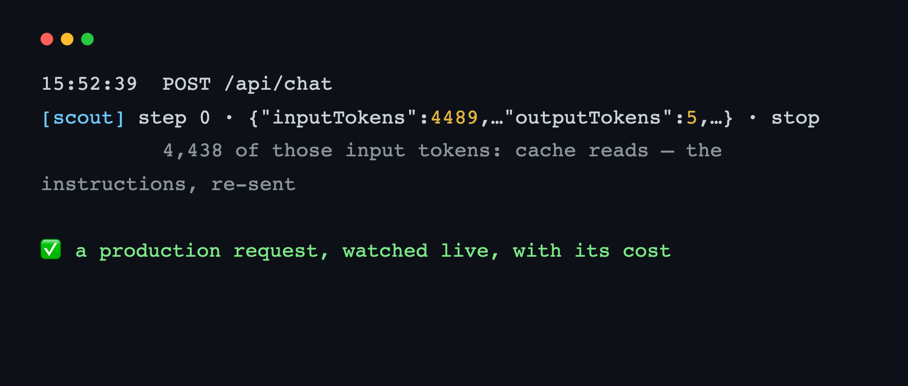

**Why it matters:** you can tell a client what their agent did at 9:14 and what it cost. **Tradeoff:** logs tell you about one request at a time; proper analytics across runs is a later module.

<!--
DEMO, not typed: live-tail on the projector while ONE student fires a request
from their terminal — the room watches someone else's request land in your logs.
4,489 input tokens, 4,438 of them cache reads: that's the instructions being
re-sent and cached. Real numbers, measured yesterday.
-->

---

<!-- _class: lead -->

## Step 05 — Now a web page calls it

*your customers won't use a terminal*

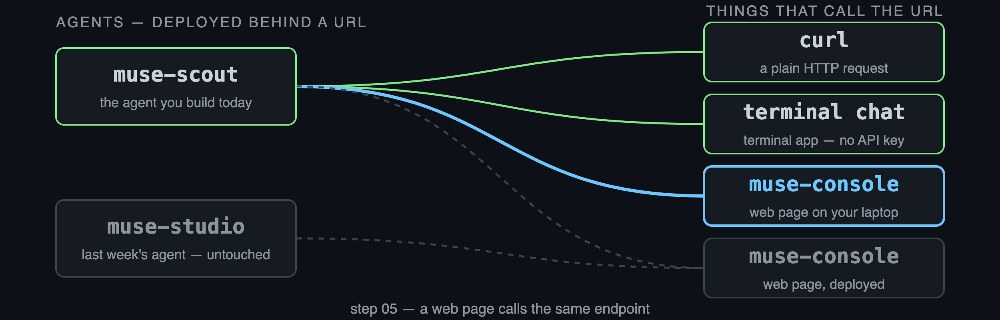

---

## Generate the frontend with Claude Code

**Prompt → `frontend/`** — a second Next.js app: the chat page and its components:

```text
Scaffold a Next.js 16 App Router app in frontend/ on port 3001, pinned to:
ai@7.0.52, @ai-sdk/react@4.0.55, next@16.2.12, react@19.2.8, react-markdown@10.
Dark product theme. Build these components (no wiring yet, I'll do that next):
Sidebar (conversation list), Messages, ToolChip (tool state machine),
SourceCard, Composer, JobStatus (ticket card), StageChip.
One env var: NEXT_PUBLIC_SCOUT_URL, in .env.local, documented in .env.example.
```

*(pins match the tested build · fell behind? `git checkout step-05 && npm install`)*

---

## The chat page, assembled

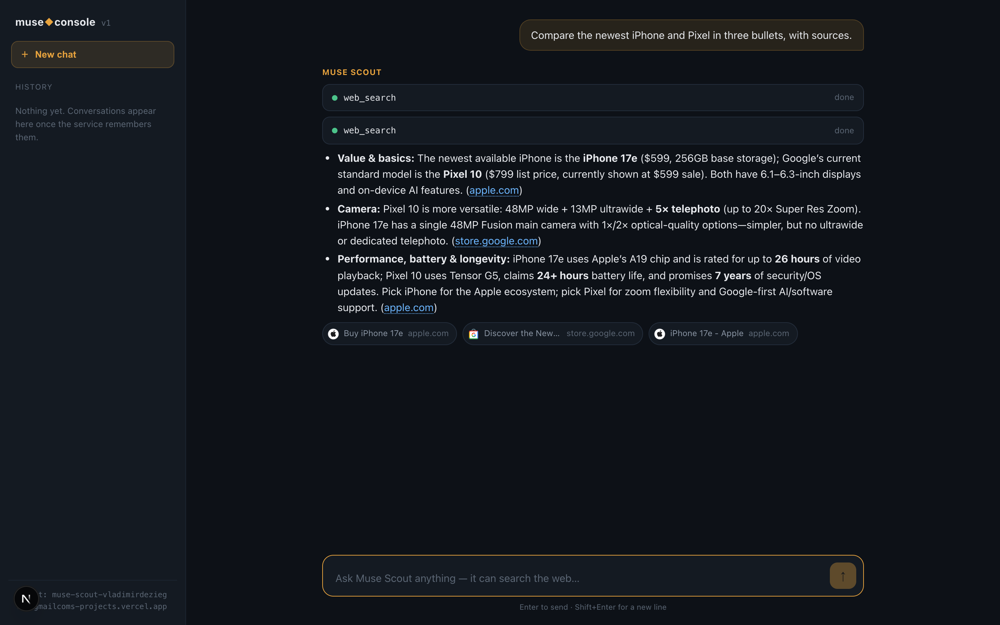

**Sidebar · Messages · ToolChip · SourceCards · Composer — the components are pre-built and styled; your job is wiring them to the endpoint.**

---

## The page needs to know exactly one thing: the URL

```ts
export const chatTransport = new DefaultChatTransport({
  api: `${process.env.NEXT_PUBLIC_SCOUT_URL}/api/chat`,
});
```

Why the `NEXT_PUBLIC_` prefix? It marks a value as **safe to ship to visitors' browsers**. A URL is fine to publish — everyone can see it anyway. An API key never is. So the page gets one public setting, and every secret stays on the server.

---

## Two deployments, one wire

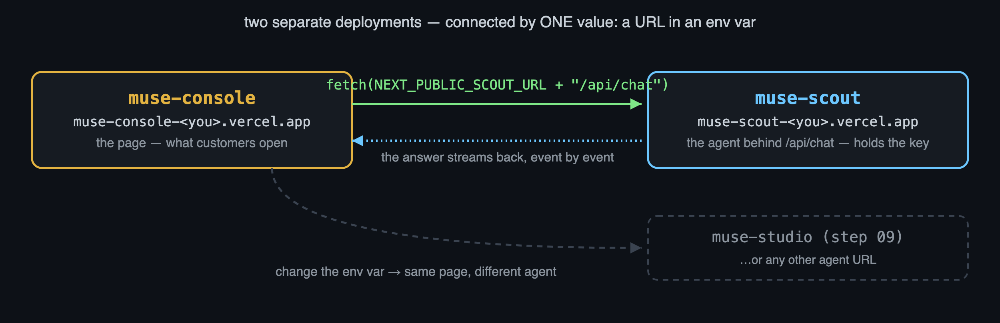

**The frontend and backend are strangers — separate apps, separate deploys, separate URLs. The only thing connecting them is that one env var holding the backend's URL.** That's why they can ship independently, why the key never leaves the backend, and why step 09 is possible at all.

<!--
Say the three consequences slowly — this slide is the module in one picture:
1. Independent deploys: fix the backend, push, the page never rebuilds (felt at the CORS fix).
2. The trust boundary: everything secret lives behind the RIGHT box's URL; the LEFT box is public code in strangers' browsers.
3. The wire is a VALUE, not code. Values can be swapped in a dashboard — that's the step-09/10 finale, teased by the dashed arrow.
-->


---

## Wire the components to the endpoint

**Prompt → `frontend/` wiring** — the components exist; connect them:

```text
Wire the muse-console frontend: page.tsx uses useChat({ id, transport }) from
@ai-sdk/react with the transport from lib/transport.ts. Composer calls
sendMessage({ text }) on Enter (Shift+Enter = newline), shows a stop button
while streaming. Messages renders message.parts: text via react-markdown with
a blinking cursor on the last part, tool-* parts through ToolChip with their
state machine, source-url parts as SourceCards. Auto-scroll unless the reader
scrolled up.
```

**Run it** · `npm run dev` → localhost:3001 — *talking to your deployed agent*

---

## The browser says no (curl still works)

```text
Access to fetch at 'https://muse-scout-….vercel.app/api/chat'
from origin 'http://localhost:3001' has been blocked by CORS policy:
Response to preflight request doesn't pass access control check:
No 'Access-Control-Allow-Origin' header is present on the requested resource.
```

Here's what's happening: **before a web page calls a server on another domain, the browser first asks that server "is this website allowed to call you?"** Our endpoint never answers that question, so the browser blocks the call. Terminals never ask — which is why curl, in the next window, still works fine.

<!--
FAILURE BEAT ② act 1. Submit → nothing. Blank stare → GOTCHA: the error is in
DevTools console, NOT on the page. Keep the step-03 curl running in a visible
terminal the whole time — the asymmetry IS the slide.
-->

---

## The tempting fix that ruins streaming

```ts
const r = await fetch(upstream, { … });
const body = await r.text();      // ← waits for the ENTIRE answer first
return new Response(body);
```

| | first byte arrives | total time |
|---|---|---|
| forwarding through this proxy | **after 38.9 s** | 38.9 s |
| calling the endpoint directly | **after 0.55 s** | 35.1 s |

**Same agent, same answer — but your user stares at a blank screen for 39 seconds.** That one `await r.text()` line quietly swallows the stream and turns it back into a blob.

<!--
Someone will suggest the proxy — if nobody does, suggest it yourself. It
"works": the answer arrives. Let the room sit through the ~39 silent seconds
once. Then the numbers: measured on this exact code.
-->

---

## The real fix: the server says who's allowed

```ts
export const CORS_HEADERS = {
  "Access-Control-Allow-Origin": "*",          // workshop mode; lock down per client later
  "Access-Control-Allow-Methods": "GET, POST, OPTIONS",
  "Access-Control-Allow-Headers": "content-type",
};
export const OPTIONS = preflight;              // the browser asks; this answers
```

```text
$ curl -X OPTIONS …/api/chat -H "Origin: http://localhost:3001" …
HTTP/2 204
access-control-allow-origin: *
```

**Redeploy the backend with `git push` — notice the page itself didn't change at all.** The two deploy independently; you just felt why that's useful.

---

## The handshake, in one picture

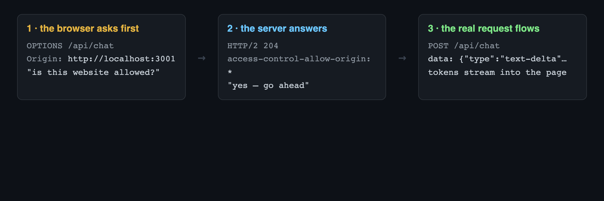

**Step 1 and 2 are invisible in your app — the browser and server handle them alone.** All you did was teach the server its answer to step 2.

---

## ✅ The answer streams into your page, word by word

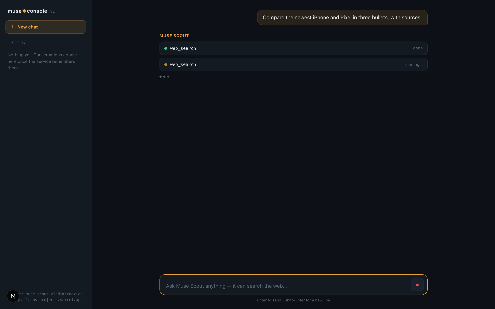

**The search chip runs to ✓, sources render as cards, and text arrives token by token — straight from your deployed agent.**

<!-- Protected Moment #1: the first token landing in their own page. Give it ten quiet seconds. -->

---

<!-- _class: lead -->

## Step 06 — Put the page itself online

*right now your product only exists on your laptop*

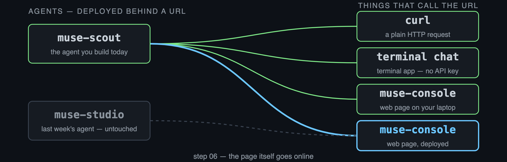

---

## Second Vercel project, same repo

1. Vercel → New Project → same GitHub repo → **Root Directory = `frontend/`**
2. Environment variable: `NEXT_PUBLIC_SCOUT_URL` = your backend's URL
3. Deployment Protection → off — *this one is a product page; people should reach it*
4. Push once; both projects rebuild (~35 s each)

*One repo, two deployed apps — the backend and the page. Splitting them is a Vercel setting, not a code change.*

---

## Changed the variable? Redeploy.

**`NEXT_PUBLIC_` values are baked into the page when it's built** — printed like ink, not read live from a config. Changing the value in Vercel does nothing to the page that's already out there.

1. Project → Settings → Environment Variables → `NEXT_PUBLIC_SCOUT_URL` = your backend URL
2. **Redeploy** — a restart is not enough; the page has to be rebuilt

*Remember this one — it comes back at step 10 and turns a scary swap into a one-minute move.*

<!--
FAILURE BEAT ③ — live room moment, NOT on a slide: let the first deploy go out
before the env var is set. Submit → error banner fills with HTML. Read it
together: two <title> tags — "404: This page could not be found." and "Muse
Console" — the page POSTed to ITSELF and got its own 404 back. Footer reads
"socket: not configured". Have captures/viz/card_404.png ready to project if a
student's screen is too small to read. Then: set the var, redeploy, works.
-->


---

## ✅ Open it on your phone

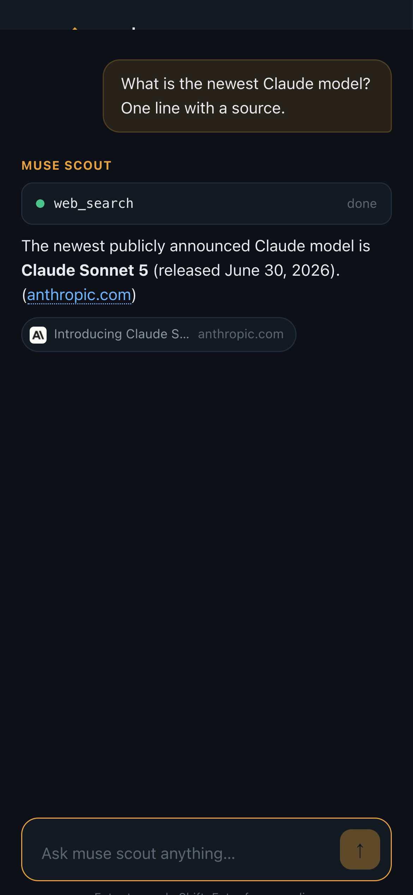

**`muse-console-<you>.vercel.app` — your page, in their pocket, talking to your agent.**

---

<!-- _class: lead -->

## Step 07 — Make it remember

*refresh the page right now and the whole conversation is gone — nothing stores it*

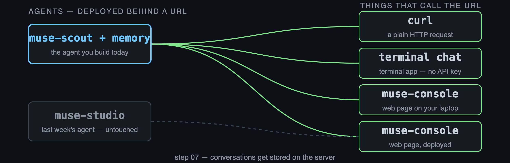

---

## Conversations get a home on the server

```sql
create table if not exists scout_conversations (
  id text primary key,          -- the CLIENT names the conversation
  title text not null default 'Untitled',
  messages jsonb not null default '[]',
  updated_at timestamptz not null default now()
);
```

**Why it matters:** "the product remembers" has to live on the server — a browser tab can't be the only copy of a customer's history. **Tradeoff:** the caller picks the conversation id, so the same id gives the same history to any app that presents it.

<!-- GOTCHA (say at the break): migration.sql is idempotent — double paste is harmless. Service key goes in the backend's Vercel env only; the page never sees Supabase. -->

---

## The endpoint loads history first, saves after

```ts
const stored = id ? await loadConversation(id) : [];
const synced = stored.some((m) => incoming.has(m.id));   // browser already has it
const uiMessages = synced ? messages : [...stored, ...messages];
onFinish: async ({ messages }) => { if (id) await saveConversation(id, messages); }
```

Two kinds of callers show up: a script that sends **one message** and needs the server to fill in the past, and a browser that **already has the whole history**. The rule: if the caller already has the history, use theirs — never merge both copies, or every message shows up twice.

---

## The sidebar is the proof

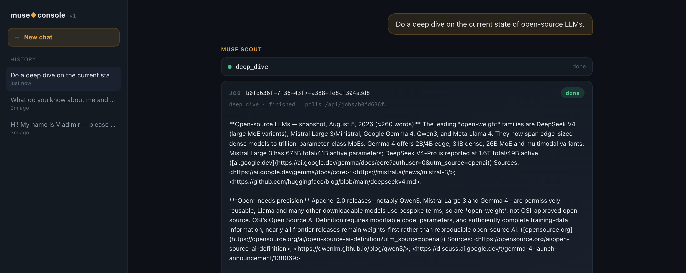

**Conversations listed, titled, reopenable — the page reads them from `GET /api/conversations`. The page didn't get smarter; the server learned to remember.**

---

## ✅ Tell the browser something, ask a script about it

**Run it** · `npm run ex 03 <conversation-id>` — *any id from the page's sidebar*

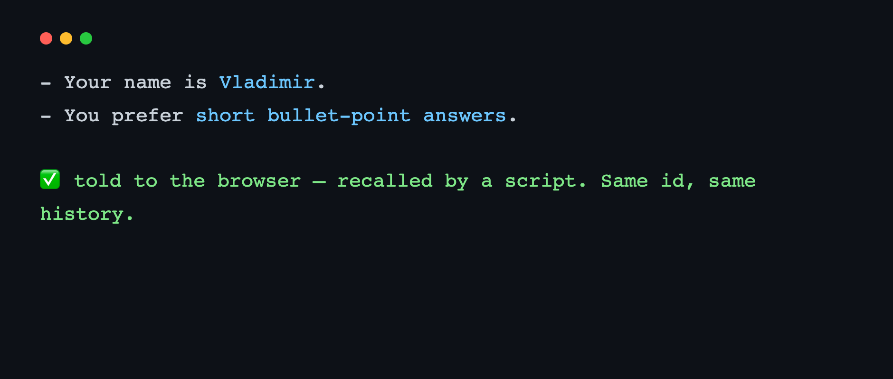

**And a brand-new conversation still knows your name — that's the `scout_memories` table.** *The memory belongs to the service, not to any one app talking to it.*

---

<!-- _class: lead -->

## Step 08 — Work that takes minutes, not seconds

*a web request wants an answer in seconds; a deep-dive report takes three minutes*

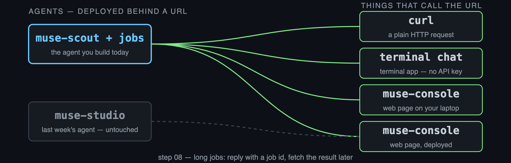

---

## Answer now with a job id, work in the background

```ts
execute: async ({ topic }) => {
  const { data } = await sb.from("scout_jobs").insert({ kind: "deep_dive", … });
  after(() => runDeepDive(data.id, topic));      // keeps working after the reply is sent
  return { job_id: data.id, note: "Deep dive queued …" };
}
```

Why the id? A deep dive takes ~3 minutes, and a web request can't stay open that long — browsers and platforms give up first. So the endpoint **answers immediately with a job id** — like a coat-check ticket — and keeps working in the background. The id is the whole deal: **anyone holding it can come back later and ask how it's going.**

<!-- GOTCHA: don't write to the DB per token — the worker writes once at the end; the UI polls every 2s. Stream to the eye, checkpoint to the database. -->

---

## How the page shows progress: it just asks again

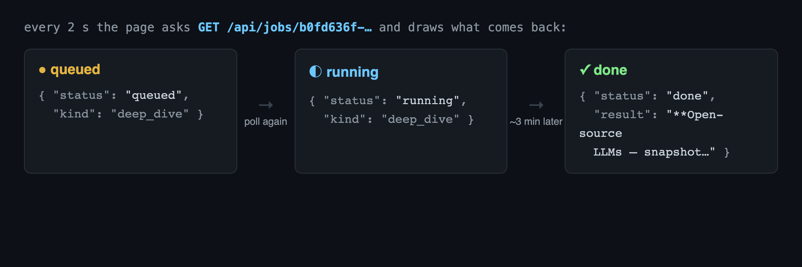

**There's a second endpoint for this — `GET /api/jobs/:id` — and the page polls it every 2 seconds.** No push, no magic: the page asks, the server answers with the current status, and the badge redraws itself from `queued` to `running` to `done`.

---

## ✅ Any app can redeem the job id

**Run it** · `curl https://muse-scout-<you>.vercel.app/api/jobs/<job-id>`

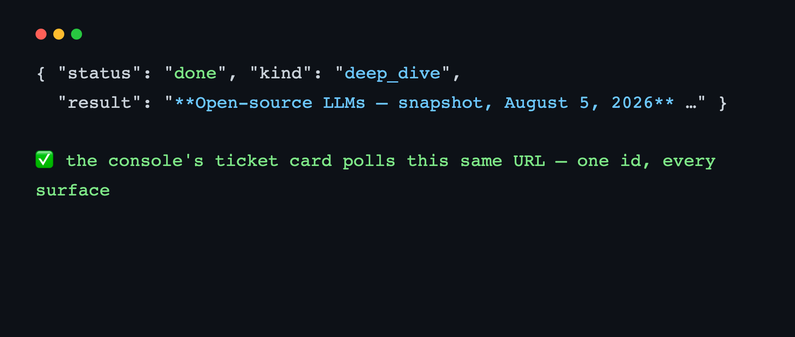

**The page's ticket card polls this same URL every 2 seconds and flips itself `queued → running → done`. A curl with the same id gets the same report.**

<!-- The card they saw seconds after asking; the curl is the same id from a terminal. If time is short this step collapses to a demo — the concept is M8's. -->

---

## The whole API, on one screen

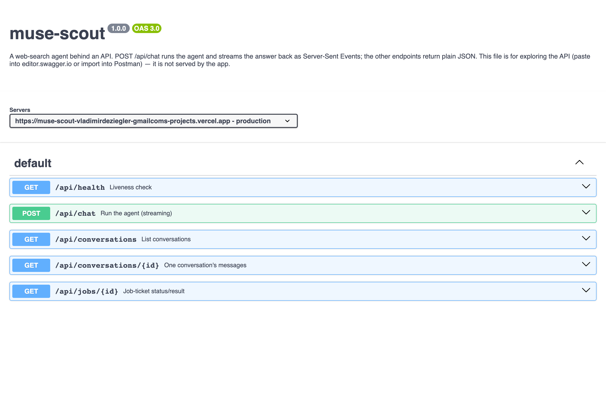

**Five endpoints now exist — described once in `backend/openapi.json`, and Swagger draws the map.** Open [editor.swagger.io](https://editor.swagger.io) → File → Import → `openapi.json` — "Try it out" hits your production URL.

<!--
Caveat to say out loud: /api/chat streams and Swagger buffers — it sits silent
until the stream finishes. curl -N stays the way to WATCH it. The other four
endpoints work perfectly in Swagger. This is also the honest answer to "how do
I explore an API I've never met."
-->

---

<!-- _class: lead -->

## Step 09 — Point the page at a different agent

*our page has only ever known a one-tool agent — let's see what it really depends on*

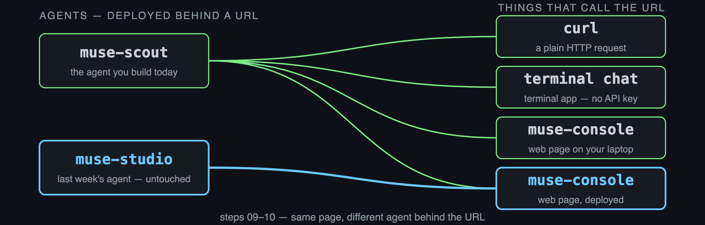

---

## An agent you can't edit

```text
$ curl -X OPTIONS https://muse-studio-….vercel.app/api/chat -H "Origin: …"
HTTP/2 204
allow: OPTIONS, POST          ← and no access-control-allow-origin, at all
```

Last week's muse-studio speaks the same streaming format — but **it never learned to tell browsers "you're allowed"** (no CORS headers). So curl can call it, and your page can't. *You'll spend your whole career meeting APIs you can't edit — here's what to do.*

---

## Forward the request — but keep it streaming

```ts
// the fix                                   // the trap from step 05, remember?
const upstream = await fetch(target, …);     const body = await r.text();
return new Response(upstream.body);          return new Response(body);
```

Since the page can't call muse-studio directly, the page's own backend forwards the request for it — that's why `frontend/app/api/relay/route.ts` exists. **It's a server file, not state management: hooks and stores live in the browser, and the browser is the thing being blocked.** One line decides everything: pass the response body straight through and it streams; `await` it first and your user is back to 39 seconds of silence.

---

## Draw things you've never seen before

**Prompt → `StageChip.tsx`** — muse-studio streams extra event types (`data-stage`) our page has never met. Render them generically:

```text
Add a StageChips component that renders any message part whose type starts
with "data-": key by part id (re-emits with the same id must update in place,
not append), show data.shape/kind, data.label, data.detail, a status dot for
running/done/failed, and data.ms as seconds. No imports from any agent
codebase — the part carries its own shape.
```

**Run it** · flip `.env.local`: `NEXT_PUBLIC_USE_RELAY=1 · RELAY_TARGET=<muse-studio-url>` → `npm run dev`

---

## ✅ Last week's agent, on today's page


**Router ✓ 1.0s · research fan-out ✓ 23.3s with 5 sources · Draft 1 ✓ 34.0s · judge ✗ *rejected* · redraft running — stages our page never heard of, drawn correctly.**

<!--
Protected Moment #2 — NEVER cut. The campaign ask, live. The judge rejection
in red is the room's proof this is real, not staged. Then say it plainly:
the page never knew which agent it was talking to. It knows a URL and a
stream format. That's why swapping agents is an afternoon, not a rewrite.
-->

---

## Step 10 — Do the same swap in production

| env var on muse-console | pointing at scout | pointing at muse-studio |
|---|---|---|
| `NEXT_PUBLIC_SCOUT_URL` | scout URL | *(empty)* |
| `NEXT_PUBLIC_USE_RELAY` | `0` | `1` |
| `RELAY_TARGET` | — | muse-studio URL |

**Change the variables, redeploy.** Why the redeploy? Step 06 taught you — these values are baked in at build time. *The failure you hit two hours ago is the reason this step takes one minute.*

---

## ✅ Full product, phone out

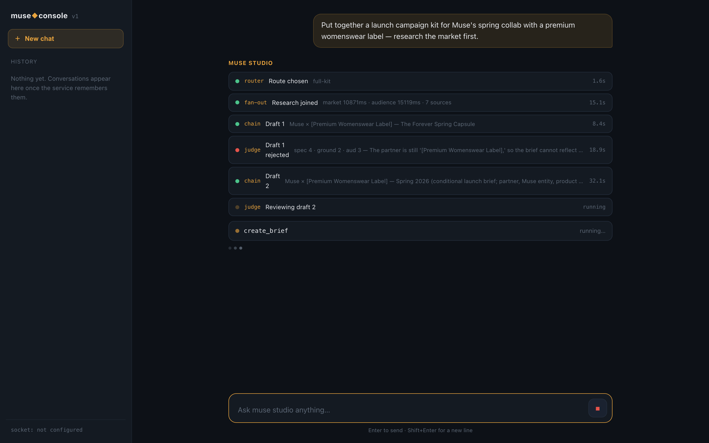

**`muse-console-<you>.vercel.app`, running last week's five-tool agent. We never touched last week's code.**

---

## Recount the six connections

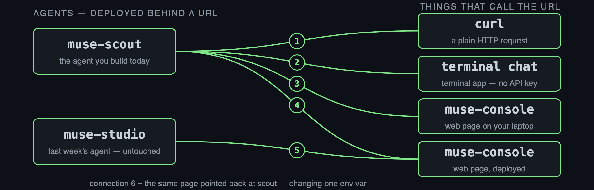

*Six. One deployed agent served four different callers; one page talked to two different agents — and the swap was one env var.*

<!-- Re-show slide 2. The room now names every element on it: the stage rail, the ticket, the transport line. Replay the campaign ask from a STUDENT's re-pointed page if time allows. -->

---

<!-- _class: lead -->

## Two things to keep

**The picture: agents on one side, everything that calls them on the other, meeting at a URL.**

**The page never cared which agent answered — that's why you could swap them in a minute.**

*Everything else is recoverable in an afternoon. Next module: the work outgrows one request, and the agent becomes a machine you operate.*
